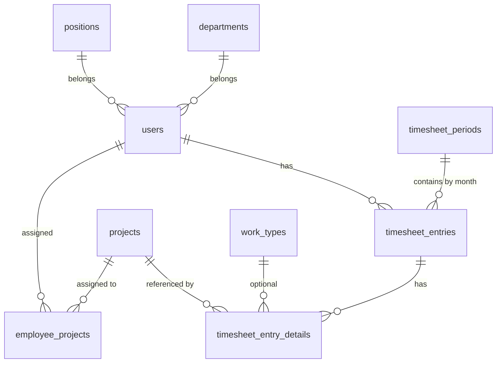

# Thiết kế Database (MVP)

## 1. Mục tiêu
Thiết kế database cho hệ thống nhập công theo dự án với các nhóm chức năng đã chốt:
- Auth (login, quên mật khẩu, đổi mật khẩu, admin reset mật khẩu)
- Quản trị user/employee
- Quản trị project
- Gán project cho nhân viên
- Nhập công theo mô hình `entry + details`
- Thống kê/báo cáo cơ bản
- Nhắc nhập công qua Slack bot lúc 20:00 JST (không dùng queue cho MVP)

## 2. Phạm vi và giả định
- DB: PostgreSQL
- Múi giờ nghiệp vụ: `Asia/Tokyo` (JST)
- Mỗi ngày của mỗi nhân viên có tối đa 1 bản ghi header (`timesheet_entries`)
- Chi tiết công việc theo project nằm ở bảng detail (`timesheet_entry_details`)
- Không lock kỳ công ở MVP (chỉ có khái niệm kỳ công theo tháng)
- Không triển khai audit log ở MVP
- Không loại trừ leave/holiday trong luồng notify ở MVP

## 3. Danh sách bảng (MVP)
1. `users`
2. `departments`
3. `positions`
4. `work_types`
5. `projects`
6. `employee_projects`
7. `timesheet_entries`
8. `timesheet_entry_details`
9. `timesheet_periods` (kỳ công theo tháng, chưa lock)
10. `notification_runs` (log mỗi lần job notify chạy)
11. `password_reset_tokens` (Laravel chuẩn)

## 4. ERD (mức khái niệm)


## 5. Thiết kế chi tiết từng bảng

### 5.1 `users`
Mục đích: lưu tài khoản đăng nhập + hồ sơ nhân viên cơ bản.

Các cột đề xuất:
- `id` BIGSERIAL PK
- `full_name` VARCHAR(150) NOT NULL
- `email` VARCHAR(255) NOT NULL UNIQUE
- `phone` VARCHAR(30) NULL
- `avatar_url` TEXT NULL
- `department_id` BIGINT NULL FK -> `departments.id`
- `position_id` BIGINT NULL FK -> `positions.id`
- `role` VARCHAR(20) NOT NULL DEFAULT `employee` (`admin|employee`)
- `status` VARCHAR(20) NOT NULL DEFAULT `active` (`active|inactive|locked`)
- `slack_user_id` VARCHAR(50) NULL
- `password` VARCHAR(255) NOT NULL (hash)
- `must_change_password` BOOLEAN NOT NULL DEFAULT TRUE
- `last_login_at` TIMESTAMPTZ NULL
- `email_verified_at` TIMESTAMPTZ NULL
- `remember_token` VARCHAR(100) NULL
- `created_at` TIMESTAMPTZ NOT NULL
- `updated_at` TIMESTAMPTZ NOT NULL
- `deleted_at` TIMESTAMPTZ NULL (soft delete)

Index đề xuất:
- `idx_users_role_status (role, status)`
- `idx_users_department_id (department_id)`
- `idx_users_position_id (position_id)`
- `idx_users_slack_user_id (slack_user_id)`

### 5.2 `departments`
Mục đích: danh mục phòng ban.

Các cột:
- `id` BIGSERIAL PK
- `code` VARCHAR(30) NOT NULL UNIQUE
- `name` VARCHAR(150) NOT NULL
- `description` TEXT NULL
- `is_active` BOOLEAN NOT NULL DEFAULT TRUE
- `created_at`, `updated_at`, `deleted_at`

### 5.3 `positions`
Mục đích: danh mục chức danh.

Các cột:
- `id` BIGSERIAL PK
- `code` VARCHAR(30) NOT NULL UNIQUE
- `name` VARCHAR(150) NOT NULL
- `description` TEXT NULL
- `is_active` BOOLEAN NOT NULL DEFAULT TRUE
- `created_at`, `updated_at`, `deleted_at`

### 5.4 `work_types`
Mục đích: danh mục loại công việc (mở rộng báo cáo sau này).

Các cột:
- `id` BIGSERIAL PK
- `code` VARCHAR(30) NOT NULL UNIQUE
- `name` VARCHAR(150) NOT NULL
- `description` TEXT NULL
- `is_active` BOOLEAN NOT NULL DEFAULT TRUE
- `created_at`, `updated_at`, `deleted_at`

### 5.5 `projects`
Mục đích: thông tin dự án và trạng thái sử dụng.

Các cột:
- `id` BIGSERIAL PK
- `project_code` VARCHAR(50) NOT NULL UNIQUE
- `project_name` VARCHAR(255) NOT NULL
- `status` VARCHAR(20) NOT NULL DEFAULT `active` (`active|inactive|archived`)
- `billable_flag` BOOLEAN NOT NULL DEFAULT FALSE
- `description` TEXT NULL
- `start_date` DATE NULL
- `end_date` DATE NULL
- `created_at`, `updated_at`, `deleted_at`

Index đề xuất:
- `idx_projects_status (status)`
- `idx_projects_billable_status (billable_flag, status)`

### 5.6 `employee_projects`
Mục đích: mapping N-N giữa nhân viên và project.

Các cột:
- `id` BIGSERIAL PK
- `employee_id` BIGINT NOT NULL FK -> `users.id`
- `project_id` BIGINT NOT NULL FK -> `projects.id`
- `assigned_at` TIMESTAMPTZ NOT NULL DEFAULT now()
- `unassigned_at` TIMESTAMPTZ NULL
- `is_active` BOOLEAN NOT NULL DEFAULT TRUE
- `created_at`, `updated_at`

Ràng buộc:
- Unique active assignment:
  - `UNIQUE (employee_id, project_id, is_active)` hoặc
  - dùng partial unique index: `UNIQUE (employee_id, project_id) WHERE is_active = true`

Index đề xuất:
- `idx_employee_projects_employee_active (employee_id, is_active)`
- `idx_employee_projects_project_active (project_id, is_active)`

### 5.7 `timesheet_periods`
Mục đích: khái niệm kỳ công theo tháng (MVP chưa lock, để sẵn mở rộng).

Các cột:
- `id` BIGSERIAL PK
- `period_month` DATE NOT NULL UNIQUE (quy ước lưu ngày đầu tháng, ví dụ `2026-04-01`)
- `status` VARCHAR(20) NOT NULL DEFAULT `open` (`open|closed|locked`)
- `note` TEXT NULL
- `created_by` BIGINT NULL FK -> `users.id`
- `updated_by` BIGINT NULL FK -> `users.id`
- `created_at`, `updated_at`

### 5.8 `timesheet_entries`
Mục đích: header timesheet theo ngày, theo user.

Các cột:
- `id` BIGSERIAL PK
- `employee_id` BIGINT NOT NULL FK -> `users.id`
- `work_date` DATE NOT NULL
- `period_id` BIGINT NULL FK -> `timesheet_periods.id`
- `total_hours` NUMERIC(5,2) NOT NULL DEFAULT 0
- `status` VARCHAR(20) NOT NULL DEFAULT `draft` (`draft|submitted`)
- `submitted_at` TIMESTAMPTZ NULL
- `created_at`, `updated_at`, `deleted_at`

Ràng buộc:
- `UNIQUE (employee_id, work_date)` để đảm bảo 1 ngày chỉ 1 entry/user.
- `CHECK (total_hours >= 0 AND total_hours <= 24)`

Index đề xuất:
- `idx_timesheet_entries_employee_date (employee_id, work_date)`
- `idx_timesheet_entries_work_date (work_date)`
- `idx_timesheet_entries_period (period_id)`

### 5.9 `timesheet_entry_details`
Mục đích: chi tiết giờ làm theo từng project trong ngày.

Các cột:
- `id` BIGSERIAL PK
- `timesheet_entry_id` BIGINT NOT NULL FK -> `timesheet_entries.id`
- `project_id` BIGINT NOT NULL FK -> `projects.id`
- `work_type_id` BIGINT NULL FK -> `work_types.id`
- `hours_worked` NUMERIC(5,2) NOT NULL
- `note` TEXT NULL
- `created_at`, `updated_at`, `deleted_at`

Ràng buộc:
- `CHECK (hours_worked >= 0 AND hours_worked <= 24)`
- Có thể thêm rule tránh trùng project trong 1 entry:
  - `UNIQUE (timesheet_entry_id, project_id)` (khuyến nghị cho MVP để đơn giản báo cáo)

Index đề xuất:
- `idx_ts_details_entry_id (timesheet_entry_id)`
- `idx_ts_details_project_id (project_id)`
- `idx_ts_details_work_type_id (work_type_id)`

### 5.10 `notification_runs`
Mục đích: log mỗi lần job notify chạy lúc 20:00 JST.

Các cột:
- `id` BIGSERIAL PK
- `target_date` DATE NOT NULL
- `timezone` VARCHAR(50) NOT NULL DEFAULT `Asia/Tokyo`
- `started_at` TIMESTAMPTZ NOT NULL
- `finished_at` TIMESTAMPTZ NULL
- `status` VARCHAR(30) NOT NULL (`processing|success|failed|skipped_weekend|skipped_duplicate`)
- `total_targets` INT NOT NULL DEFAULT 0
- `sent_count` INT NOT NULL DEFAULT 0
- `skipped_count` INT NOT NULL DEFAULT 0
- `failed_count` INT NOT NULL DEFAULT 0
- `error_message` TEXT NULL
- `slack_channel` VARCHAR(100) NULL
- `message_preview` TEXT NULL
- `created_at`, `updated_at`

Ràng buộc:
- Nên quản lý idempotency theo ngày JST:
  - `UNIQUE (target_date, timezone)`

### 5.11 `password_reset_tokens`
Mục đích: dùng flow quên mật khẩu (Laravel mặc định).

Các cột tham chiếu Laravel:
- `email` VARCHAR(255) PK/index
- `token` VARCHAR(255)
- `created_at` TIMESTAMPTZ NULL

## 6. Quy tắc dữ liệu quan trọng cần xử lý ở BE
- Không cho nhập công ngày tương lai.
- Tổng giờ mỗi ngày/user không vượt 24.
- Chỉ cho nhập project đang được assign active.
- Khi unassign project: không xoá dữ liệu timesheet cũ.
- `must_change_password = true` với user mới tạo; đổi mật khẩu xong set về `false`.

## 7. SQL ràng buộc mẫu (PostgreSQL)
```sql
-- 1 user / 1 ngày / 1 entry
CREATE UNIQUE INDEX uq_timesheet_entries_employee_work_date
ON timesheet_entries(employee_id, work_date)
WHERE deleted_at IS NULL;

-- Assignment active không trùng
CREATE UNIQUE INDEX uq_employee_projects_active
ON employee_projects(employee_id, project_id)
WHERE is_active = true;
```

## 8. Gợi ý thứ tự migration
1. `departments`, `positions`, `work_types`
2. `users`
3. `projects`
4. `employee_projects`
5. `timesheet_periods`
6. `timesheet_entries`
7. `timesheet_entry_details`
8. `password_reset_tokens` (nếu chưa có từ Laravel)
9. `notification_runs`

## 9. Phần mở rộng sau MVP (không làm ngay)
- Profit/Loss theo dự án:
  - thêm bảng `project_finance_profiles` (rate chuẩn theo man-day/giờ)
  - thêm bảng `project_revenue_costs` theo tháng
- Lock kỳ công:
  - dùng `timesheet_periods.status = locked` và chặn create/update/delete theo kỳ
- Leave/Holiday:
  - thêm `holidays`, `employee_leaves` để tinh chỉnh rule notify
