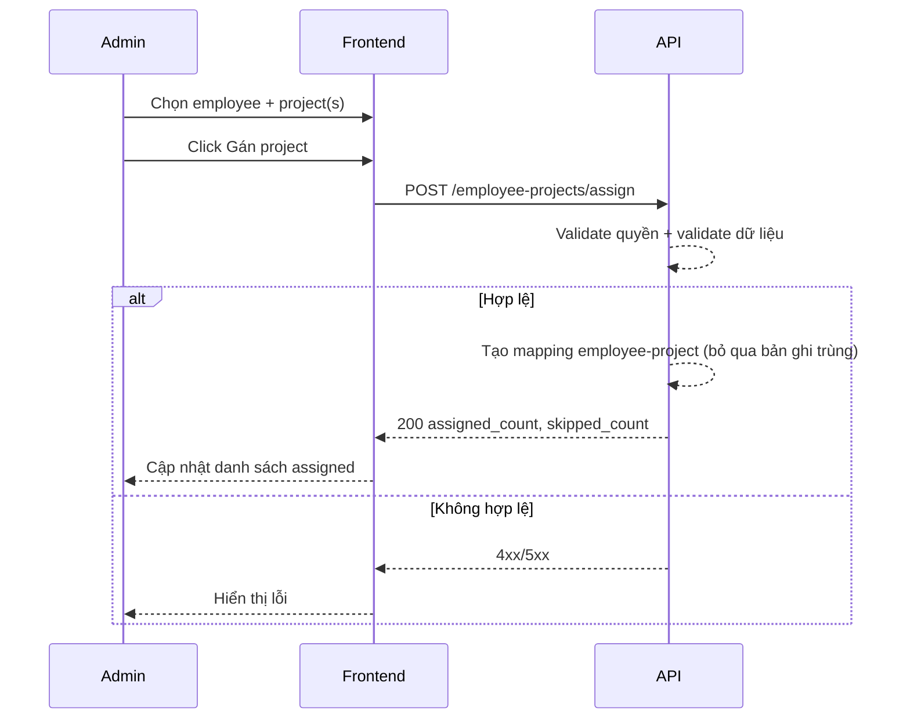

# FLOW-ADMIN-ASSIGN-01 - Gán project cho nhân viên

## 1. Mục tiêu
Cho admin gán một hoặc nhiều project cho employee để employee chỉ nhìn thấy và nhập công trên các project được phép.

## 2. Vai trò tham gia
- Admin
- Frontend màn hình `SCR-10`
- Assignment API

## 3. Điều kiện đầu vào
- Admin đã đăng nhập hợp lệ
- Employee đã tồn tại
- Project đã tồn tại

## 4. Kết quả đầu ra
- Quan hệ `employee-project` được tạo thành công
- Employee nhìn thấy project mới sau khi refresh danh sách project cá nhân
- Project mới được phép chọn khi nhập timesheet

## 5. Luồng chính (Happy Path)
1. Admin mở màn hình assign project.
2. Chọn employee cần gán.
3. Chọn một hoặc nhiều project từ danh sách available.
4. Bấm `Gán project` hoặc `Lưu thay đổi`.
5. Frontend gọi API assign.
6. Backend validate quyền admin.
7. Backend kiểm tra employee/project tồn tại.
8. Backend tạo mapping employee-project.
9. Backend trả success.
10. Frontend cập nhật danh sách assigned projects.

## 6. Luồng thay thế và lỗi
### L1 - Gán trùng project
1. Backend phát hiện mapping đã tồn tại.
2. Backend bỏ qua bản ghi trùng và tiếp tục xử lý các project còn lại.
3. Frontend hiển thị thông báo kết quả (đã gán mới bao nhiêu, bỏ qua bao nhiêu).

### L2 - Employee hoặc project không tồn tại
1. Backend trả `404`.
2. Frontend hiển thị lỗi.

### L3 - Không đủ quyền
1. Backend trả `403`.

## 7. Business rules
- BR-ASSIGN-01: Chỉ admin được gán project.
- BR-ASSIGN-02: Không tạo mapping trùng.
- BR-ASSIGN-03: Chỉ project trạng thái phù hợp (thường `active`) mới cho gán.
- BR-ASSIGN-04: Một employee có thể được gán nhiều project.
- BR-ASSIGN-05: Sau khi gán thành công, employee được nhập công ngay trên project đó.

## 8. API mapping
### API-01: Assign projects
- Method: `POST`
- Endpoint: `/api/v1/admin/employee-projects/assign`

Request body ví dụ:
```json
{
  "employee_id": 101,
  "project_ids": [10227, 10963, 7451]
}
```

Success response gợi ý:
```json
{
  "assigned_count": 2,
  "skipped_count": 1,
  "skipped_project_ids": [7451]
}
```

Error response gợi ý:
- `400`: request không hợp lệ
- `403`: không đủ quyền
- `404`: employee/project không tồn tại
- `500`: lỗi hệ thống

## 9. Điểm cần test
- Gán 1 project thành công.
- Gán nhiều project thành công.
- Gán trùng project.
- Gán project inactive (nếu chặn).
- User không phải admin gọi API.

## 10. Sequence flow (rút gọn)

