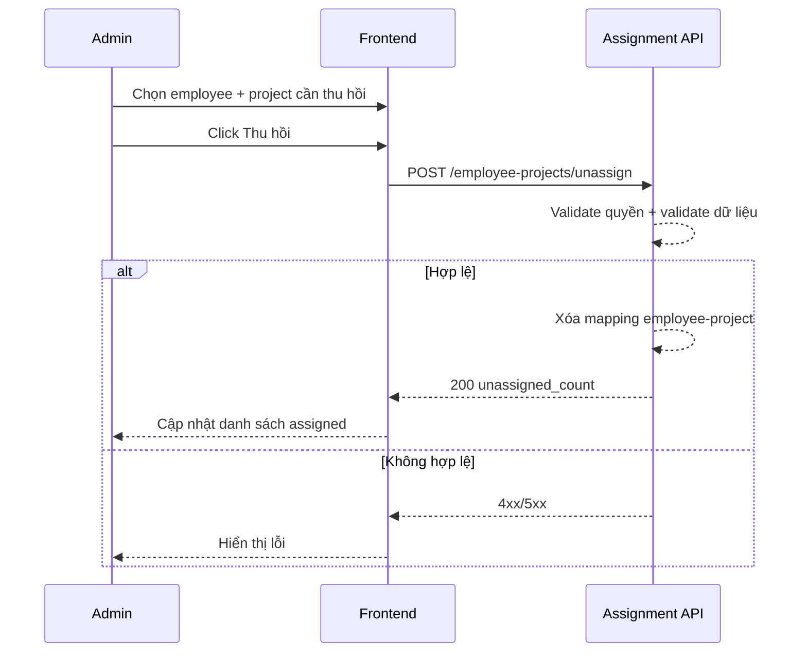

# FLOW-ADMIN-ASSIGN-02 - Thu hồi project khỏi nhân viên

## 1. Mục tiêu
Cho admin thu hồi quyền nhập công của employee trên project không còn phụ trách.

## 2. Vai trò tham gia
- Admin
- Frontend màn hình `SCR-10`
- Assignment API

## 3. Điều kiện đầu vào
- Admin đã đăng nhập hợp lệ
- Employee đã tồn tại
- Mapping employee-project đã tồn tại

## 4. Kết quả đầu ra
- Mapping employee-project bị gỡ
- Employee không còn thấy project trong danh sách project được assign
- Employee không thể tạo mới timesheet detail cho project đã bị thu hồi

## 5. Luồng chính (Happy Path)
1. Admin mở màn hình `Phân công project`.
2. Chọn employee cần chỉnh sửa assignment.
3. Chọn project trong danh sách `Đã gán`.
4. Bấm `Thu hồi`.
5. Frontend gọi API unassign.
6. Backend validate quyền admin.
7. Backend kiểm tra mapping employee-project tồn tại.
8. Backend xóa mapping assignment.
9. Backend trả success.
10. Frontend cập nhật danh sách assigned projects.

## 6. Luồng thay thế và lỗi
### L1 - Mapping không tồn tại
1. Backend trả `404`.
2. Frontend hiển thị thông báo "Project đã được thu hồi trước đó".

### L2 - Không đủ quyền
1. Backend trả `403`.

### L3 - Dữ liệu request không hợp lệ
1. Backend trả `400` hoặc `422`.
2. Frontend hiển thị lỗi tương ứng.

## 7. Business rules
- BR-UNASSIGN-01: Chỉ admin được thu hồi project.
- BR-UNASSIGN-02: Chỉ thu hồi trên mapping đang tồn tại.
- BR-UNASSIGN-03: Thu hồi chỉ ảnh hưởng quyền nhập công mới, không xóa dữ liệu timesheet đã phát sinh trước đó.
- BR-UNASSIGN-04: Sau khi thu hồi, project không còn hiển thị ở dropdown chọn project của employee.

## 8. API mapping
### API-01: Unassign project
- Method: `POST`
- Endpoint: `/api/v1/admin/employee-projects/unassign`

Request body ví dụ:
```json
{
  "employee_id": 101,
  "project_ids": [10963]
}
```

Success response gợi ý:
```json
{
  "unassigned_count": 1
}
```

Error response gợi ý:
- `400`: request không hợp lệ
- `403`: không đủ quyền
- `404`: mapping không tồn tại
- `500`: lỗi hệ thống

## 9. Điểm cần test
- Thu hồi 1 project thành công.
- Thu hồi nhiều project thành công (nếu UI hỗ trợ multi-select).
- Thu hồi project không tồn tại mapping.
- User không phải admin gọi API.
- Sau khi thu hồi, employee không còn chọn được project ở form nhập công.

## 10. Sequence flow (rút gọn)

