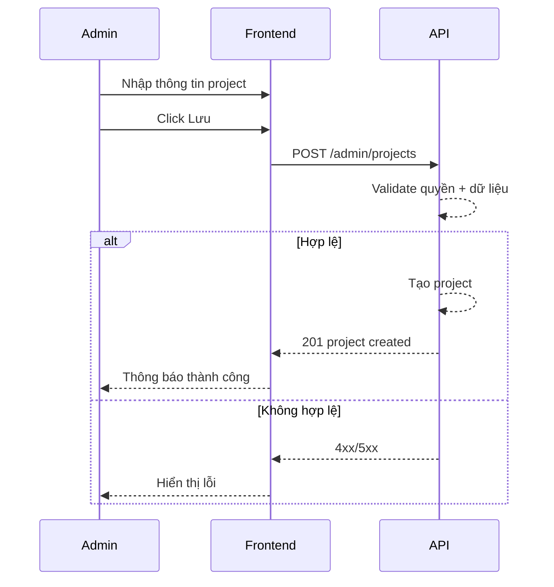

# FLOW-ADMIN-PROJECT-01 - Tạo project

## 1. Mục tiêu
Cho admin tạo mới project để phục vụ assign và nhập timesheet.

## 2. Vai trò tham gia
- Admin
- Frontend màn hình `SCR-06` và `SCR-07`
- Project API

## 3. Điều kiện đầu vào
- Admin đăng nhập hợp lệ
- Có quyền quản trị project

## 4. Kết quả đầu ra
- Project mới được tạo thành công
- Project xuất hiện trong danh sách project

## 5. Luồng chính (Happy Path)
1. Admin mở form tạo project.
2. Nhập thông tin: mã, tên, trạng thái, billable, mô tả.
3. Bấm `Lưu`.
4. Frontend validate dữ liệu.
5. Gọi API create project.
6. Backend validate quyền + uniqueness `project_code`.
7. Backend tạo project.
8. Backend trả success.
9. Frontend hiển thị thông báo và refresh danh sách.

## 6. Luồng thay thế và lỗi
### L1 - Trùng mã dự án
1. Backend trả `409` hoặc `422`.
2. Frontend hiển thị lỗi field `project_code`.

### L2 - Thiếu field bắt buộc
1. Frontend chặn submit hoặc backend trả `422`.

### L3 - Không đủ quyền
1. Backend trả `403`.

## 7. Business rules
- BR-PROJ-CREATE-01: Chỉ admin được tạo project.
- BR-PROJ-CREATE-02: `project_code` phải unique.
- BR-PROJ-CREATE-03: `status` phải hợp lệ (`active|inactive|archived`).

## 8. API mapping
### API-01: Create project
- Method: `POST`
- Endpoint: `/api/v1/admin/projects`

Request body ví dụ:
```json
{
  "project_code": "PJ-10963",
  "project_name": "WORK DESIGN PLATFORM_2026/4",
  "status": "active",
  "billable_flag": true,
  "description": "Dự án WDP tháng 04/2026"
}
```

Success response gợi ý:
```json
{
  "id": 10963,
  "project_code": "PJ-10963",
  "status": "active"
}
```

Error response gợi ý:
- `400`, `403`, `409/422`, `500`

## 9. Điểm cần test
- Tạo project hợp lệ.
- Trùng mã dự án.
- Thiếu field bắt buộc.
- User không phải admin.

## 10. Sequence flow (rút gọn)

