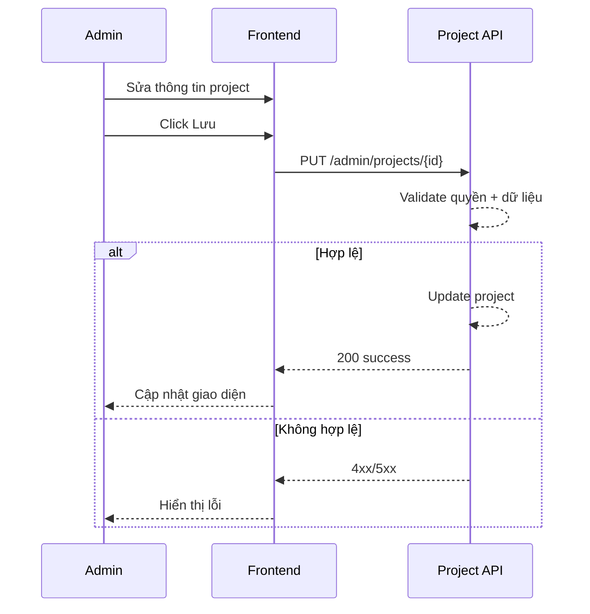

# FLOW-ADMIN-PROJECT-02 - Cập nhật project

## 1. Mục tiêu
Cho admin cập nhật thông tin project hiện có.

## 2. Vai trò tham gia
- Admin
- Frontend màn hình `SCR-06` và `SCR-07`
- Project API

## 3. Điều kiện đầu vào
- Admin đăng nhập hợp lệ
- Project mục tiêu tồn tại

## 4. Kết quả đầu ra
- Thông tin project được cập nhật thành công
- Dữ liệu mới hiển thị trong danh sách project

## 5. Luồng chính (Happy Path)
1. Admin chọn project cần sửa.
2. Frontend load dữ liệu hiện tại.
3. Admin chỉnh thông tin và bấm `Lưu`.
4. Frontend gọi API update project.
5. Backend validate quyền và dữ liệu.
6. Backend cập nhật project.
7. Backend trả success.
8. Frontend refresh danh sách.

## 6. Luồng thay thế và lỗi
### L1 - Project không tồn tại
1. Backend trả `404`.

### L2 - Trùng mã dự án khi sửa
1. Backend trả `409` hoặc `422`.

### L3 - Không đủ quyền
1. Backend trả `403`.

## 7. Business rules
- BR-PROJ-UPD-01: Chỉ admin cập nhật project.
- BR-PROJ-UPD-02: `project_code` unique sau cập nhật.
- BR-PROJ-UPD-03: Trạng thái project phải thuộc tập hợp hợp lệ.

## 8. API mapping
### API-01: Update project
- Method: `PUT`
- Endpoint: `/api/v1/admin/projects/{project_id}`

Request body ví dụ:
```json
{
  "project_name": "WORK DESIGN PLATFORM_2026/5",
  "status": "active",
  "billable_flag": true,
  "description": "Cập nhật scope tháng 05"
}
```

Success response gợi ý:
```json
{
  "id": 10963,
  "project_name": "WORK DESIGN PLATFORM_2026/5"
}
```

Error response gợi ý:
- `400`, `403`, `404`, `409/422`, `500`

## 9. Điểm cần test
- Update project thành công.
- Update project không tồn tại.
- Trùng mã dự án.
- Không đủ quyền.

## 10. Sequence flow (rút gọn)

