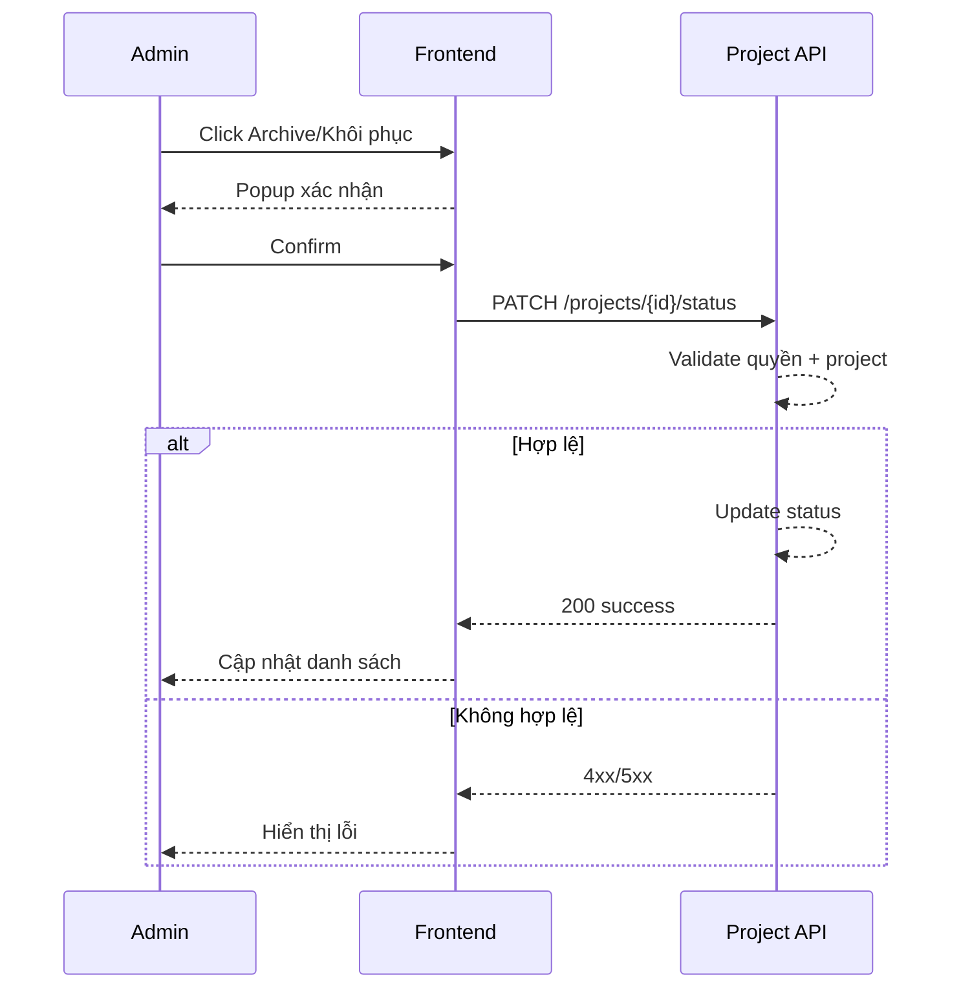

# FLOW-ADMIN-PROJECT-03 - Archive/khôi phục project

## 1. Mục tiêu
Cho admin chuyển project sang trạng thái archive hoặc khôi phục lại để kiểm soát vòng đời dự án mà không xóa cứng dữ liệu.

## 2. Vai trò tham gia
- Admin
- Frontend màn hình `SCR-06`
- Project API

## 3. Điều kiện đầu vào
- Admin đăng nhập hợp lệ
- Project mục tiêu tồn tại

## 4. Kết quả đầu ra
- Trạng thái project được đổi sang `archived` hoặc `active/inactive` theo thao tác
- Project archived không còn xuất hiện trong danh sách assign mặc định

## 5. Luồng chính (Happy Path)
1. Admin chọn project trong danh sách.
2. Bấm `Archive` hoặc `Khôi phục`.
3. Frontend hiển thị xác nhận thao tác.
4. Admin xác nhận.
5. Frontend gọi API đổi trạng thái project.
6. Backend validate quyền + kiểm tra project tồn tại.
7. Backend cập nhật trạng thái.
8. Backend trả success.
9. Frontend cập nhật danh sách project.

## 6. Luồng thay thế và lỗi
### L1 - Project không tồn tại
1. Backend trả `404`.

### L2 - Không đủ quyền
1. Backend trả `403`.

### L3 - Không thể archive do ràng buộc nghiệp vụ
1. Backend trả `422` (nếu có rule đặc biệt).

## 7. Business rules
- BR-PROJ-AR-01: Ưu tiên archive thay vì xóa vật lý.
- BR-PROJ-AR-02: Project archived không cho assign mới.
- BR-PROJ-AR-03: Chỉ admin được đổi trạng thái vòng đời project.

## 8. API mapping
### API-01: Update project lifecycle status
- Method: `PATCH`
- Endpoint: `/api/v1/admin/projects/{project_id}/status`

Request body ví dụ:
```json
{
  "status": "archived"
}
```

Success response gợi ý:
```json
{
  "id": 10963,
  "status": "archived"
}
```

Error response gợi ý:
- `403`, `404`, `422`, `500`

## 9. Điểm cần test
- Archive project thành công.
- Khôi phục project thành công.
- Project không tồn tại.
- Không đủ quyền.
- Kiểm tra project archived không xuất hiện trong màn assign mặc định.

## 10. Sequence flow (rút gọn)

