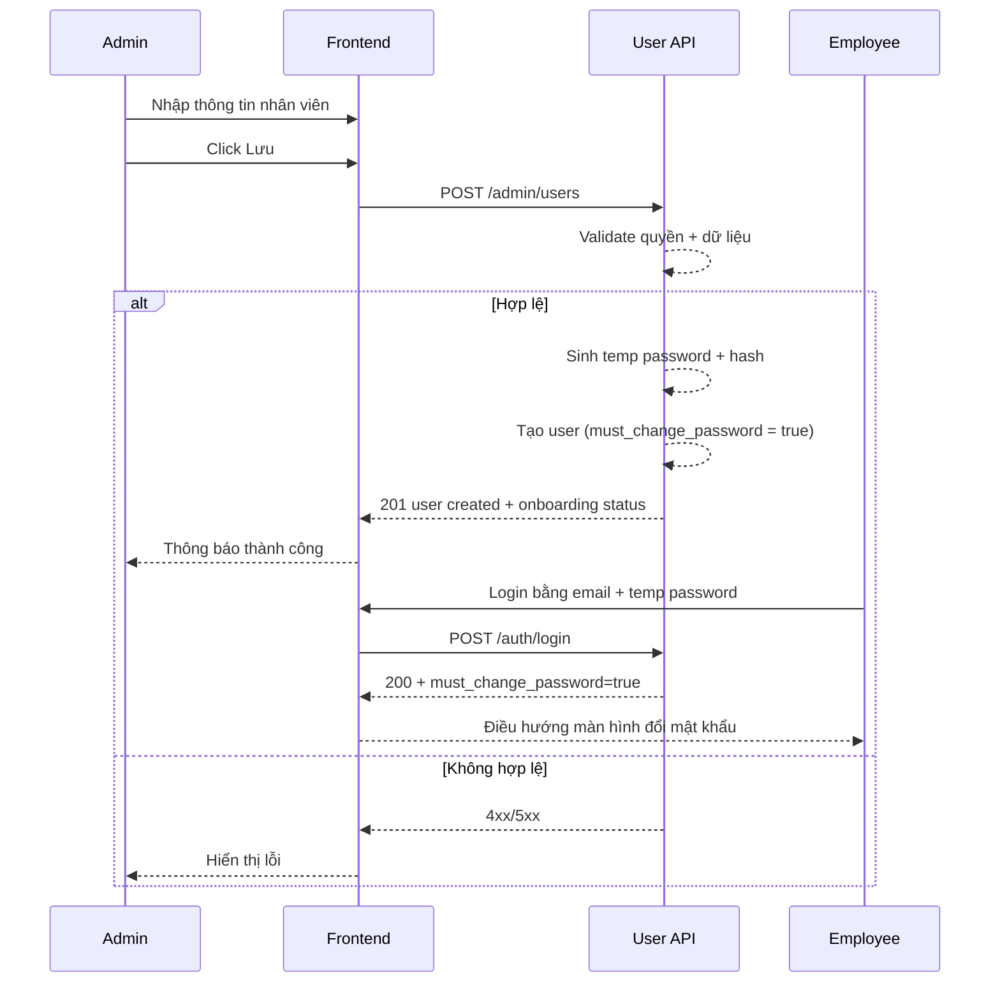

# FLOW-ADMIN-USER-01 - Tạo nhân viên/user

## 1. Mục tiêu
Cho admin tạo mới hồ sơ nhân viên và tài khoản đăng nhập employee, kèm cơ chế cấp mật khẩu tạm để nhân viên có thể đăng nhập lần đầu.

## 2. Vai trò tham gia
- Admin
- Frontend màn hình `SCR-08` và `SCR-09`
- User API

## 3. Điều kiện đầu vào
- Admin đã đăng nhập hợp lệ
- Có quyền quản trị user
- Dữ liệu danh mục (phòng ban, chức danh) đã sẵn sàng nếu dùng dropdown

## 4. Kết quả đầu ra
- Nhân viên mới được tạo thành công
- Tài khoản login employee được tạo kèm
- Mật khẩu tạm được khởi tạo
- Tài khoản được gắn cờ `must_change_password = true`
- Nhân viên mới xuất hiện trong danh sách quản lý user

## 5. Luồng chính (Happy Path)
1. Admin mở màn hình `Tạo nhân viên`.
2. Admin nhập thông tin: họ tên, email, phòng ban, vị trí, trạng thái.
3. Admin bấm `Lưu`.
4. Frontend validate dữ liệu bắt buộc.
5. Frontend gọi API tạo user.
6. Backend kiểm tra quyền admin.
7. Backend validate dữ liệu và uniqueness (email).
8. Backend sinh mật khẩu tạm (random, đủ mạnh) và hash trước khi lưu.
9. Backend tạo user + hồ sơ nhân viên với cờ `must_change_password = true`.
10. Backend trả success kèm thông tin onboarding (ví dụ: có gửi email hay không, có cần admin gửi thủ công hay không).
11. Frontend hiển thị thông báo tạo thành công và hướng dẫn bước đăng nhập lần đầu cho nhân viên.
12. Nhân viên đăng nhập lần đầu bằng email + mật khẩu tạm.
13. Hệ thống điều hướng nhân viên sang màn hình đổi mật khẩu bắt buộc.
14. Sau khi đổi mật khẩu thành công, nhân viên vào hệ thống bình thường.

## 6. Luồng thay thế và lỗi
### L1 - Email đã tồn tại
1. Backend trả `409` hoặc `422`.
2. Frontend hiển thị lỗi tại field email.

### L2 - Thiếu dữ liệu bắt buộc
1. Frontend chặn submit hoặc backend trả `422`.
2. Hiển thị lỗi theo field.

### L3 - Không đủ quyền
1. Backend trả `403`.

### L4 - Không gửi được email mời (nếu có tích hợp email)
1. Backend vẫn có thể tạo user thành công.
2. Backend trả trạng thái warning để admin biết cần gửi thông tin đăng nhập thủ công hoặc dùng admin reset password.
3. Frontend hiển thị cảnh báo không chặn luồng tạo user.

## 7. Business rules
- BR-USER-CREATE-01: Chỉ admin được tạo user.
- BR-USER-CREATE-02: `email` phải unique.
- BR-USER-CREATE-03: Role mặc định khi tạo là `employee`.
- BR-USER-CREATE-04: Trạng thái mặc định nên là `active` trừ khi admin chọn khác.
- BR-USER-CREATE-05: Khi tạo mới phải có mật khẩu tạm để user đăng nhập lần đầu.
- BR-USER-CREATE-06: Bắt buộc đổi mật khẩu ở lần đăng nhập đầu tiên (`must_change_password = true`).
- BR-USER-CREATE-07: Mật khẩu chỉ lưu dạng hash, không lưu plain text trong DB/log.

## 8. API mapping
### API-01: Create user
- Method: `POST`
- Endpoint: `/api/v1/admin/users`

Request body ví dụ:
```json
{
  "full_name": "Tran Thi Hoa",
  "email": "tran.hoa@company.com",
  "phone": "0901234567",
  "department_id": 3,
  "position_id": 5,
  "role": "employee",
  "status": "active",
  "send_invitation_email": true
}
```

Success response gợi ý:
```json
{
  "id": 101,
  "full_name": "Tran Thi Hoa",
  "email": "tran.hoa@company.com",
  "role": "employee",
  "status": "active",
  "must_change_password": true,
  "onboarding": {
    "temp_password_generated": true,
    "invitation_email_sent": true
  }
}
```

Error response gợi ý:
- `400`, `403`, `409/422`, `500`

## 9. Điểm cần test
- Tạo user hợp lệ thành công.
- Tạo user với email trùng.
- Thiếu field bắt buộc.
- User không phải admin gọi API.
- User mới login lần đầu bị bắt buộc đổi mật khẩu.
- Sau khi đổi mật khẩu, login lại vào được hệ thống.
- Trường hợp gửi email mời thất bại nhưng user vẫn được tạo.

## 10. Sequence flow (rút gọn)

