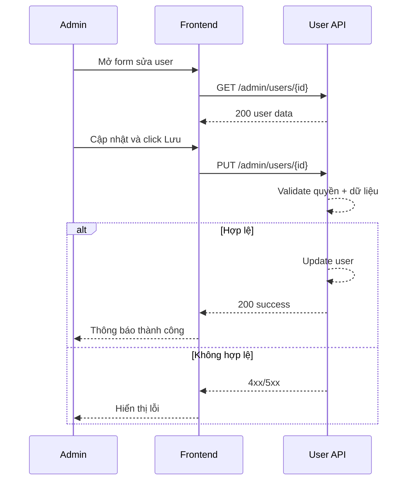

# FLOW-ADMIN-USER-02 - Cập nhật thông tin nhân viên

## 1. Mục tiêu
Cho admin cập nhật thông tin nhân viên/user hiện có.

## 2. Vai trò tham gia
- Admin
- Frontend màn hình `SCR-08` và `SCR-09`
- User API

## 3. Điều kiện đầu vào
- Admin đã đăng nhập hợp lệ
- User cần cập nhật đã tồn tại

## 4. Kết quả đầu ra
- Thông tin user được cập nhật thành công
- Dữ liệu mới hiển thị trong danh sách user

## 5. Luồng chính (Happy Path)
1. Admin mở danh sách user và chọn `Sửa`.
2. Frontend load dữ liệu hiện tại.
3. Admin chỉnh thông tin.
4. Admin bấm `Lưu`.
5. Frontend gọi API cập nhật.
6. Backend validate quyền admin và dữ liệu update.
7. Backend cập nhật user.
8. Backend trả success.
9. Frontend hiển thị thông báo thành công.

## 6. Luồng thay thế và lỗi
### L1 - User không tồn tại
1. Backend trả `404`.
2. Frontend hiển thị lỗi và quay lại danh sách.

### L2 - Email mới bị trùng
1. Backend trả `409` hoặc `422`.
2. Frontend hiển thị lỗi tại field email.

### L3 - Không đủ quyền
1. Backend trả `403`.

## 7. Business rules
- BR-USER-UPD-01: Chỉ admin được cập nhật user người khác.
- BR-USER-UPD-02: Email vẫn phải unique sau khi cập nhật.
- BR-USER-UPD-03: Không cho đổi role tùy tiện nếu chưa có chính sách rõ.

## 8. API mapping
### API-01: Update user
- Method: `PUT`
- Endpoint: `/api/v1/admin/users/{user_id}`

Request body ví dụ:
```json
{
  "full_name": "Tran Thi Hoa",
  "phone": "0908888888",
  "department_id": 4,
  "position_id": 6,
  "status": "active"
}
```

Success response gợi ý:
```json
{
  "id": 101,
  "full_name": "Tran Thi Hoa",
  "status": "active"
}
```

Error response gợi ý:
- `400`, `403`, `404`, `409/422`, `500`

## 9. Điểm cần test
- Cập nhật user thành công.
- Cập nhật user không tồn tại.
- Cập nhật email trùng.
- User không phải admin gọi API.

## 10. Sequence flow (rút gọn)

