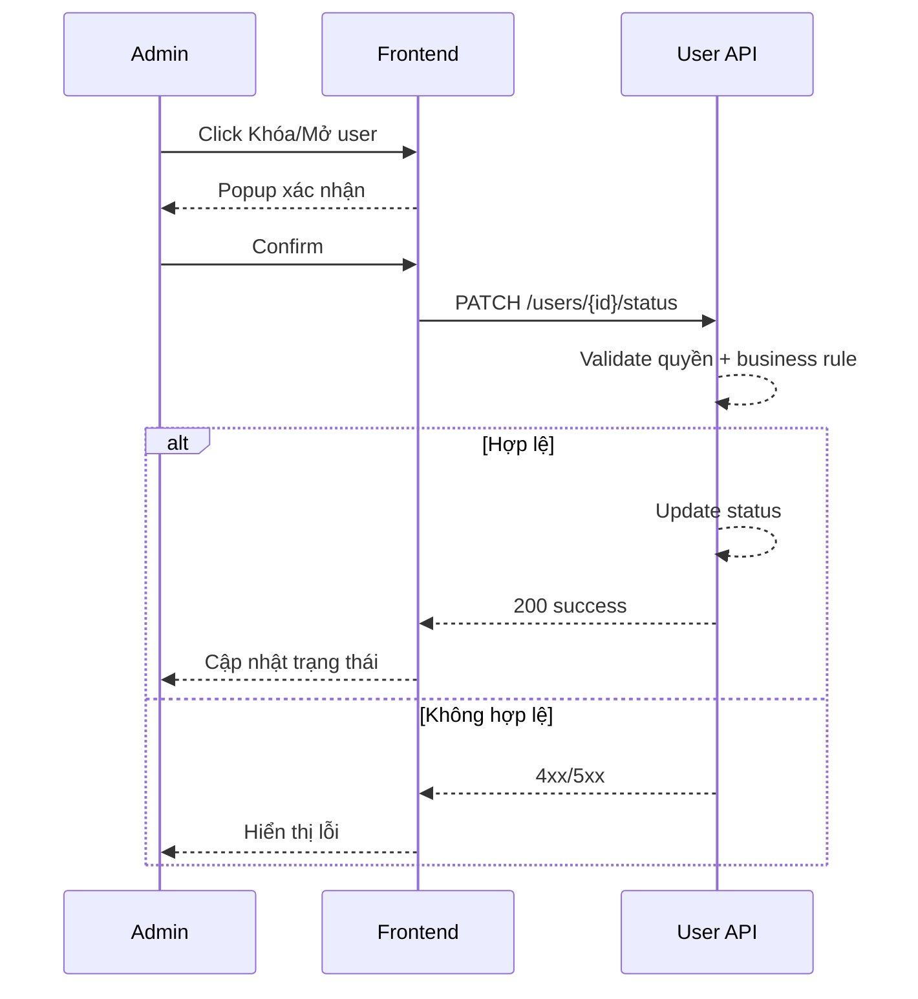

# FLOW-ADMIN-USER-03 - Khóa/Mở tài khoản

## 1. Mục tiêu
Cho admin khóa hoặc mở khóa tài khoản user để kiểm soát quyền đăng nhập.

## 2. Vai trò tham gia
- Admin
- Frontend màn hình `SCR-08`
- User API

## 3. Điều kiện đầu vào
- Admin đã đăng nhập hợp lệ
- User mục tiêu tồn tại

## 4. Kết quả đầu ra
- Trạng thái user chuyển thành `inactive` (khóa) hoặc `active` (mở)
- Nếu khóa, user không đăng nhập được

## 5. Luồng chính (Happy Path)
1. Admin chọn user trên danh sách.
2. Admin bấm `Khóa` hoặc `Mở`.
3. Frontend hiển thị xác nhận.
4. Admin xác nhận thao tác.
5. Frontend gọi API đổi trạng thái.
6. Backend validate quyền admin.
7. Backend cập nhật trạng thái user.
8. Backend trả success.
9. Frontend cập nhật trạng thái trên bảng.

## 6. Luồng thay thế và lỗi
### L1 - User không tồn tại
1. Backend trả `404`.

### L2 - Không đủ quyền
1. Backend trả `403`.

### L3 - Rule chặn khóa tài khoản đặc biệt
1. Backend trả `422` nếu vi phạm rule (ví dụ không cho khóa admin cuối cùng).

## 7. Business rules
- BR-USER-LOCK-01: Chỉ admin được khóa/mở user.
- BR-USER-LOCK-02: User bị khóa không thể login.
- BR-USER-LOCK-03: Khuyến nghị chặn khóa tài khoản admin cuối cùng.

## 8. API mapping
### API-01: Lock/Unlock user
- Method: `PATCH`
- Endpoint: `/api/v1/admin/users/{user_id}/status`

Request body ví dụ:
```json
{
  "status": "inactive"
}
```

Success response gợi ý:
```json
{
  "id": 101,
  "status": "inactive"
}
```

Error response gợi ý:
- `403`, `404`, `422`, `500`

## 9. Điểm cần test
- Khóa user thành công.
- Mở lại user thành công.
- User bị khóa thử đăng nhập (phải fail).
- Không đủ quyền.
- Rule chặn khóa admin cuối cùng (nếu bật).

## 10. Sequence flow (rút gọn)

