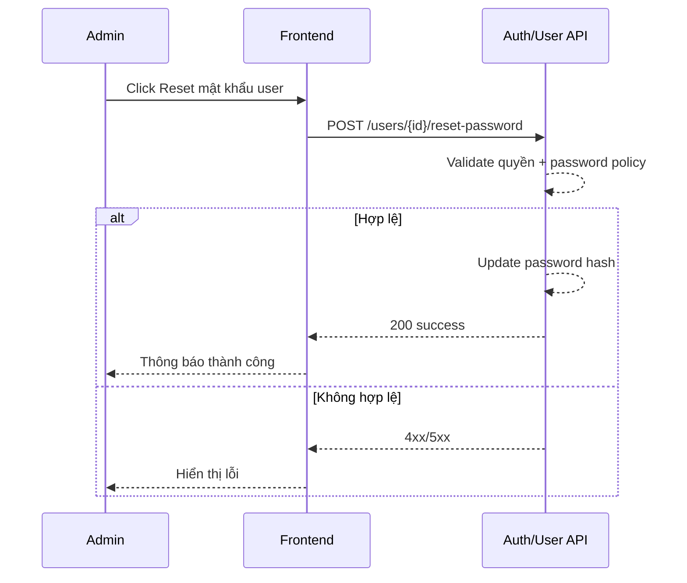

# FLOW-ADMIN-USER-04 - Admin reset mật khẩu

## 1. Mục tiêu
Cho admin đặt lại mật khẩu tạm thời cho user khi user quên mật khẩu hoặc cần hỗ trợ khẩn.

## 2. Vai trò tham gia
- Admin
- Frontend màn hình `SCR-08`
- Auth/User API

## 3. Điều kiện đầu vào
- Admin đăng nhập hợp lệ
- User mục tiêu tồn tại

## 4. Kết quả đầu ra
- Mật khẩu user được reset thành mật khẩu mới (hoặc tạm)
- User có thể đăng nhập bằng mật khẩu mới

## 5. Luồng chính (Happy Path)
1. Admin chọn user cần reset mật khẩu.
2. Admin bấm `Reset mật khẩu`.
3. Frontend mở form nhập mật khẩu mới hoặc xác nhận tạo mật khẩu tạm.
4. Admin xác nhận.
5. Frontend gọi API reset mật khẩu.
6. Backend validate quyền admin.
7. Backend cập nhật mật khẩu user (hash).
8. Backend trả success.
9. Frontend hiển thị thông báo thành công.

## 6. Luồng thay thế và lỗi
### L1 - User không tồn tại
1. Backend trả `404`.

### L2 - Mật khẩu mới không đạt policy
1. Backend trả `422`.
2. Frontend hiển thị lỗi policy.

### L3 - Không đủ quyền
1. Backend trả `403`.

## 7. Business rules
- BR-USER-RP-01: Chỉ admin được reset mật khẩu cho user khác.
- BR-USER-RP-02: Mật khẩu mới phải đạt policy bảo mật.
- BR-USER-RP-03: Khuyến nghị log audit cho hành động reset mật khẩu.

## 8. API mapping
### API-01: Admin reset password
- Method: `POST`
- Endpoint: `/api/v1/admin/users/{user_id}/reset-password`

Request body ví dụ:
```json
{
  "new_password": "TempPass123!"
}
```

Success response gợi ý:
```json
{
  "message": "Reset mật khẩu thành công."
}
```

Error response gợi ý:
- `403`, `404`, `422`, `500`

## 9. Điểm cần test
- Reset mật khẩu thành công.
- User không tồn tại.
- Mật khẩu không đạt policy.
- Không đủ quyền.

## 10. Sequence flow (rút gọn)

