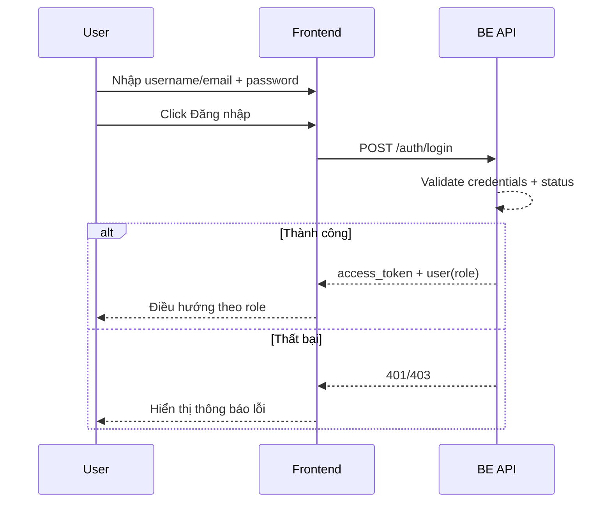

# FLOW-AUTH-01 - Login

## 1. Mục tiêu
Cho người dùng đăng nhập thành công vào hệ thống và điều hướng đúng khu vực theo role.

## 2. Vai trò tham gia
- Người dùng hệ thống (`admin` hoặc `employee`)
- Auth API (Laravel + JWT)

## 3. Điều kiện đầu vào
- Người dùng có tài khoản tồn tại trong hệ thống
- Tài khoản đang ở trạng thái active
- Người dùng truy cập màn hình `SCR-01 Login`

## 4. Kết quả đầu ra
- Nếu thành công:
  - JWT token được cấp
  - Thông tin user profile cơ bản được trả về
  - Điều hướng:
    - `admin` -> khu vực admin
    - `employee` -> employee dashboard
- Nếu thất bại:
  - Hiển thị thông báo lỗi phù hợp

## 5. Luồng chính (Happy Path)
1. Người dùng nhập `email_or_username` và `password`.
2. Người dùng bấm nút `Đăng nhập`.
3. Frontend validate dữ liệu bắt buộc.
4. Frontend gọi API đăng nhập.
5. Backend kiểm tra:
  - user tồn tại
  - password đúng
  - user active
6. Backend trả về token + thông tin user.
7. Frontend lưu token theo cơ chế bảo mật đã chọn.
8. Frontend gọi API lấy profile (nếu cần).
9. Frontend điều hướng theo role.

## 6. Luồng thay thế và lỗi

### L1 - Thiếu dữ liệu đầu vào
1. Người dùng bấm `Đăng nhập` khi thiếu 1 trong 2 trường.
2. Frontend không gọi API.
3. Hiển thị lỗi validation tại form.

### L2 - Sai tài khoản hoặc mật khẩu
1. Frontend gửi request login.
2. Backend trả về lỗi thông tin đăng nhập không hợp lệ.
3. Frontend hiển thị thông báo lỗi chung.

### L3 - Tài khoản bị khóa/inactive
1. Frontend gửi request login.
2. Backend phát hiện trạng thái tài khoản không hợp lệ.
3. Backend trả về mã lỗi account inactive/locked.
4. Frontend hiển thị thông báo phù hợp.

### L4 - Lỗi hệ thống hoặc timeout
1. Request thất bại do lỗi server/network.
2. Frontend hiển thị thông báo và cho phép thử lại.

## 7. Business rules
- BR-LOGIN-01: `email_or_username` và `password` là bắt buộc.
- BR-LOGIN-02: Không tiết lộ chi tiết “sai email hay sai mật khẩu”.
- BR-LOGIN-03: Chỉ user active mới được đăng nhập.
- BR-LOGIN-04: Điều hướng sau login phụ thuộc vào role.
- BR-LOGIN-05: Token phải có hạn sử dụng và cơ chế refresh/đăng nhập lại rõ ràng.

## 8. API mapping gợi ý

### API-01: Login
- Method: `POST`
- Endpoint: `/api/v1/auth/login`
- Request body:
```json
{
  "email_or_username": "tran.hoa@company.com",
  "password": "******"
}
```
- Success response:
```json
{
  "access_token": "jwt-token",
  "token_type": "Bearer",
  "expires_in": 3600,
  "user": {
    "id": 101,
    "full_name": "Tran Thi Hoa",
    "email": "tran.hoa@company.com",
    "role": "employee",
    "status": "active"
  }
}
```
- Error response gợi ý:
  - `400` dữ liệu không hợp lệ
  - `401` sai tài khoản/mật khẩu
  - `403` tài khoản bị khóa/inactive
  - `429` vượt ngưỡng thử login (nếu bật rate limit)
  - `500` lỗi hệ thống

### API-02: Lấy profile sau login (tuỳ chọn)
- Method: `GET`
- Endpoint: `/api/v1/auth/me`
- Header: `Authorization: Bearer <token>`

## 9. Điểm cần test (QA checklist)
- Đăng nhập đúng với tài khoản admin.
- Đăng nhập đúng với tài khoản employee.
- Sai mật khẩu.
- User không tồn tại.
- User inactive/locked.
- Form bỏ trống 1 trong 2 field.
- Hết hạn token và xử lý đăng nhập lại.
- Điều hướng sau login đúng theo role.

## 10. Sequence flow (rút gọn)

