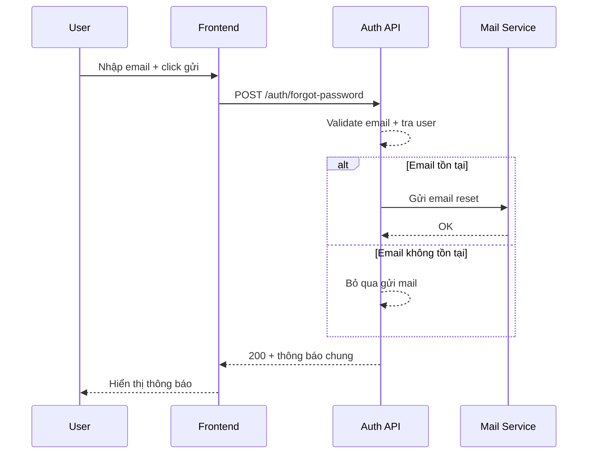

# FLOW-AUTH-02 - Quên mật khẩu

## 1. Mục tiêu
Cho người dùng gửi yêu cầu đặt lại mật khẩu qua email một cách an toàn, không làm lộ thông tin tài khoản trong hệ thống.

## 2. Vai trò tham gia
- User chưa đăng nhập
- Frontend màn hình `SCR-02`
- Auth API (Laravel)
- Dịch vụ gửi email

## 3. Điều kiện đầu vào
- User truy cập màn hình quên mật khẩu
- User có email cần nhập

## 4. Kết quả đầu ra
- Nếu hợp lệ: hệ thống tạo token reset và gửi email
- Frontend luôn hiển thị thông báo chung kiểu: "Nếu email tồn tại, hệ thống đã gửi hướng dẫn"

## 5. Luồng chính (Happy Path)
1. User nhập email và bấm `Gửi link reset`.
2. Frontend validate định dạng email.
3. Frontend gọi API quên mật khẩu.
4. Backend kiểm tra email có tồn tại không.
5. Nếu tồn tại, backend tạo reset token có hạn và gửi email.
6. Backend trả response thành công dạng thông báo chung.
7. Frontend hiển thị thông báo và cho user quay lại trang login.

## 6. Luồng thay thế và lỗi
### L1 - Email sai định dạng
1. Frontend chặn submit và hiển thị lỗi tại field email.

### L2 - Email không tồn tại
1. Backend không tạo token.
2. Backend vẫn trả thông báo chung để tránh lộ dữ liệu hệ thống.

### L3 - Lỗi gửi email
1. Backend ghi log lỗi gửi mail.
2. Backend có thể trả `500` hoặc trả success + queue retry theo thiết kế.

## 7. Business rules
- BR-AUTH-FP-01: Email phải đúng định dạng.
- BR-AUTH-FP-02: Không tiết lộ email có tồn tại hay không.
- BR-AUTH-FP-03: Reset token phải có hạn sử dụng.
- BR-AUTH-FP-04: Có thể giới hạn tần suất gửi lại email reset.

## 8. API mapping
### API-01: Quên mật khẩu
- Method: `POST`
- Endpoint: `/api/v1/auth/forgot-password`

Request body ví dụ:
```json
{
  "email": "tran.hoa@company.com"
}
```

Success response gợi ý:
```json
{
  "message": "Nếu email tồn tại, hệ thống đã gửi hướng dẫn đặt lại mật khẩu."
}
```

Error response gợi ý:
- `400`: request sai định dạng
- `429`: vượt tần suất gửi lại
- `500`: lỗi hệ thống

## 9. Điểm cần test
- Email hợp lệ tồn tại trong hệ thống.
- Email hợp lệ nhưng không tồn tại.
- Email sai định dạng.
- Gửi liên tiếp nhiều lần (rate limit).
- Kiểm tra email reset có được gửi và token có hạn.

## 10. Sequence flow (rút gọn)

