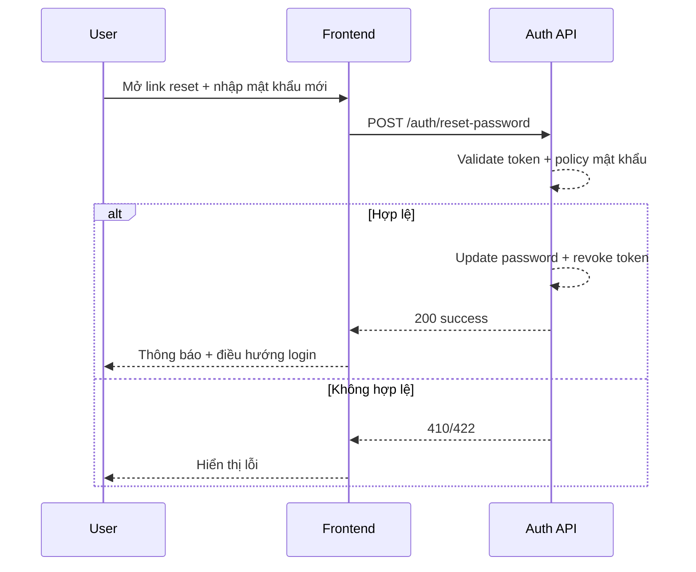

# FLOW-AUTH-03 - Đặt lại mật khẩu

## 1. Mục tiêu
Cho người dùng cập nhật mật khẩu mới bằng token reset đã nhận qua email.

## 2. Vai trò tham gia
- User chưa đăng nhập
- Frontend màn hình `SCR-03`
- Auth API (Laravel)

## 3. Điều kiện đầu vào
- User có token reset hợp lệ từ email
- User truy cập trang đặt lại mật khẩu

## 4. Kết quả đầu ra
- Mật khẩu mới được cập nhật thành công
- Token reset bị vô hiệu sau khi dùng
- User được điều hướng về login

## 5. Luồng chính (Happy Path)
1. User mở link reset chứa token.
2. User nhập mật khẩu mới + xác nhận mật khẩu.
3. Frontend validate dữ liệu.
4. Frontend gọi API đặt lại mật khẩu.
5. Backend kiểm tra token còn hiệu lực và đúng user.
6. Backend cập nhật mật khẩu mới (hash).
7. Backend thu hồi token reset.
8. Backend trả success.
9. Frontend thông báo thành công và chuyển về login.

## 6. Luồng thay thế và lỗi
### L1 - Token hết hạn/không hợp lệ
1. Backend trả lỗi token invalid/expired.
2. Frontend hiển thị thông báo yêu cầu gửi lại email reset.

### L2 - Mật khẩu và xác nhận không khớp
1. Frontend chặn submit.
2. Hiển thị lỗi tại field xác nhận.

### L3 - Mật khẩu không đạt policy
1. Backend hoặc frontend trả lỗi validation.
2. User phải nhập lại mật khẩu theo policy.

## 7. Business rules
- BR-AUTH-RP-01: Token reset chỉ dùng một lần.
- BR-AUTH-RP-02: Token phải còn hạn.
- BR-AUTH-RP-03: Mật khẩu mới phải đạt policy bảo mật.
- BR-AUTH-RP-04: Sau khi reset thành công, token cũ vô hiệu.

## 8. API mapping
### API-01: Đặt lại mật khẩu
- Method: `POST`
- Endpoint: `/api/v1/auth/reset-password`

Request body ví dụ:
```json
{
  "token": "reset-token",
  "new_password": "NewPassword123!",
  "confirm_password": "NewPassword123!"
}
```

Success response gợi ý:
```json
{
  "message": "Đặt lại mật khẩu thành công."
}
```

Error response gợi ý:
- `400`: dữ liệu không hợp lệ
- `410`: token hết hạn
- `422`: vi phạm policy mật khẩu
- `500`: lỗi hệ thống

## 9. Điểm cần test
- Token hợp lệ, đổi mật khẩu thành công.
- Token hết hạn.
- Token không tồn tại/đã dùng.
- Mật khẩu và xác nhận không khớp.
- Mật khẩu không đạt policy.

## 10. Sequence flow (rút gọn)

