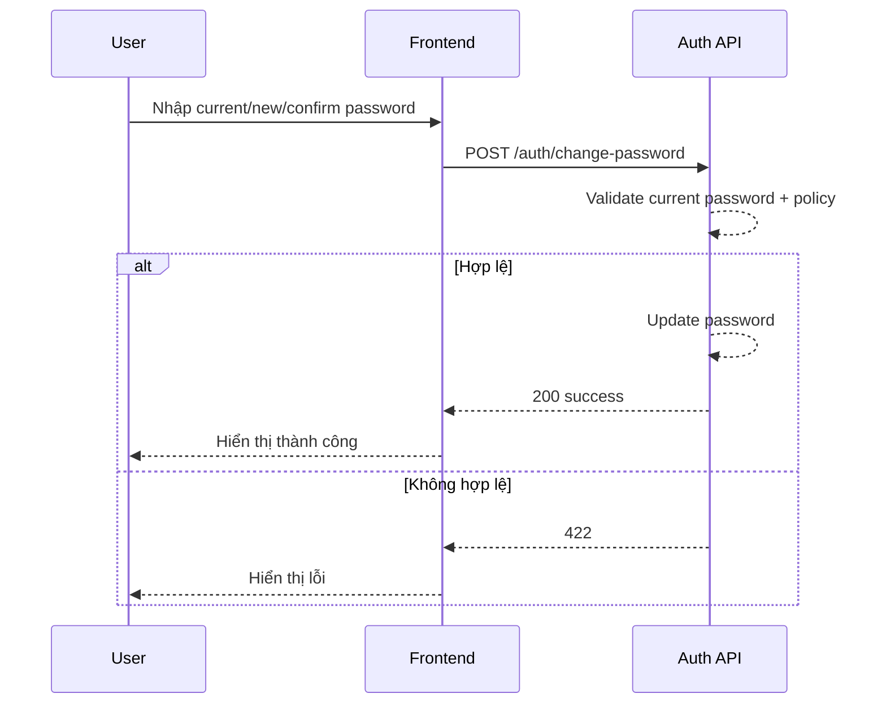

# FLOW-AUTH-04 - Đổi mật khẩu khi đã đăng nhập

## 1. Mục tiêu
Cho user đã đăng nhập đổi mật khẩu ngay trong hồ sơ cá nhân.

## 2. Vai trò tham gia
- Admin hoặc Employee đã đăng nhập
- Frontend màn hình `SCR-04`
- Auth API (Laravel)

## 3. Điều kiện đầu vào
- User đã login hợp lệ
- Token JWT còn hiệu lực

## 4. Kết quả đầu ra
- Mật khẩu được đổi thành công
- Các token/phiên cũ có thể bị thu hồi theo chính sách bảo mật

## 5. Luồng chính (Happy Path)
1. User mở tab đổi mật khẩu.
2. Nhập `current_password`, `new_password`, `confirm_password`.
3. Frontend validate dữ liệu.
4. Frontend gọi API đổi mật khẩu.
5. Backend kiểm tra mật khẩu hiện tại đúng.
6. Backend validate policy mật khẩu mới.
7. Backend cập nhật mật khẩu.
8. Backend trả success.
9. Frontend hiển thị thông báo thành công.

## 6. Luồng thay thế và lỗi
### L1 - Sai mật khẩu hiện tại
1. Backend trả `422` hoặc `401` theo chuẩn.
2. Frontend hiển thị lỗi.

### L2 - Mật khẩu mới không đạt policy
1. Backend/Frontend báo lỗi policy.

### L3 - Xác nhận mật khẩu không khớp
1. Frontend chặn submit.

## 7. Business rules
- BR-AUTH-CP-01: Phải xác thực đúng mật khẩu hiện tại.
- BR-AUTH-CP-02: Mật khẩu mới phải đạt policy.
- BR-AUTH-CP-03: Mật khẩu mới khác mật khẩu hiện tại (khuyến nghị).
- BR-AUTH-CP-04: Có thể thu hồi token cũ sau khi đổi mật khẩu.

## 8. API mapping
### API-01: Đổi mật khẩu
- Method: `POST`
- Endpoint: `/api/v1/auth/change-password`

Request body ví dụ:
```json
{
  "current_password": "OldPassword123!",
  "new_password": "NewPassword123!",
  "confirm_password": "NewPassword123!"
}
```

Success response gợi ý:
```json
{
  "message": "Đổi mật khẩu thành công."
}
```

Error response gợi ý:
- `401`: chưa xác thực
- `422`: sai mật khẩu hiện tại hoặc policy không đạt
- `500`: lỗi hệ thống

## 9. Điểm cần test
- Đổi mật khẩu thành công.
- Sai mật khẩu hiện tại.
- Mật khẩu mới không đạt policy.
- Xác nhận không khớp.
- Kiểm tra phiên đăng nhập sau đổi mật khẩu.

## 10. Sequence flow (rút gọn)

