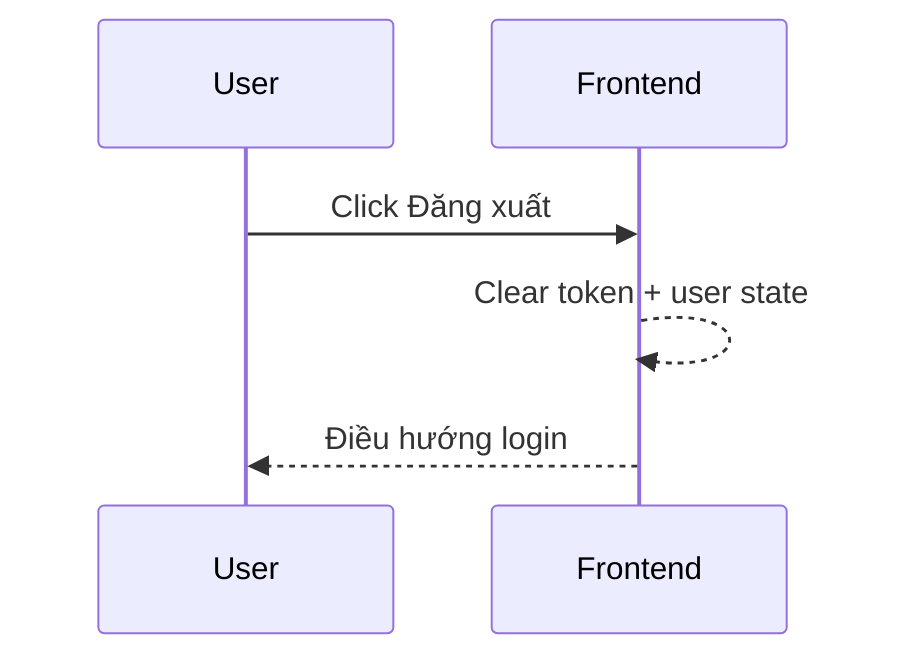

# FLOW-AUTH-05 - Đăng xuất

## 1. Mục tiêu
Cho user kết thúc phiên đăng nhập an toàn.

## 2. Vai trò tham gia
- Admin/Employee đã đăng nhập
- Frontend

## 3. Điều kiện đầu vào
- User có token hợp lệ trên client

## 4. Kết quả đầu ra
- Client xóa thông tin phiên (token, user state) và điều hướng về login
- Các request API protected sau đó không thể gọi thành công do không còn token

## 5. Luồng chính (Happy Path)
1. User bấm `Đăng xuất`.
2. Frontend xóa token và state người dùng tại client.
3. Frontend xóa dữ liệu liên quan trong storage (nếu có).
4. Frontend chuyển về trang login.

## 6. Luồng thay thế và lỗi
### L1 - Storage lỗi khi xóa
1. Frontend vẫn force clear in-memory state.
2. Điều hướng login để kết thúc phiên hiện tại.

## 7. Business rules
- BR-AUTH-LO-01: Logout phải xóa token phía client.
- BR-AUTH-LO-02: Sau logout, mọi API protected phải bị chặn do thiếu token.
- BR-AUTH-LO-03: Nếu hệ thống cần thu hồi token tức thời đa thiết bị, lúc đó mới cần thêm API revoke.

## 8. API mapping
- Không cần API cho MVP theo quyết định hiện tại.
- Logout được xử lý hoàn toàn ở frontend (client-side logout).

## 9. Điểm cần test
- Logout thành công bình thường.
- Sau logout không gọi được API protected.
- Refresh browser sau logout vẫn ở trạng thái chưa đăng nhập.

## 10. Sequence flow (rút gọn)

