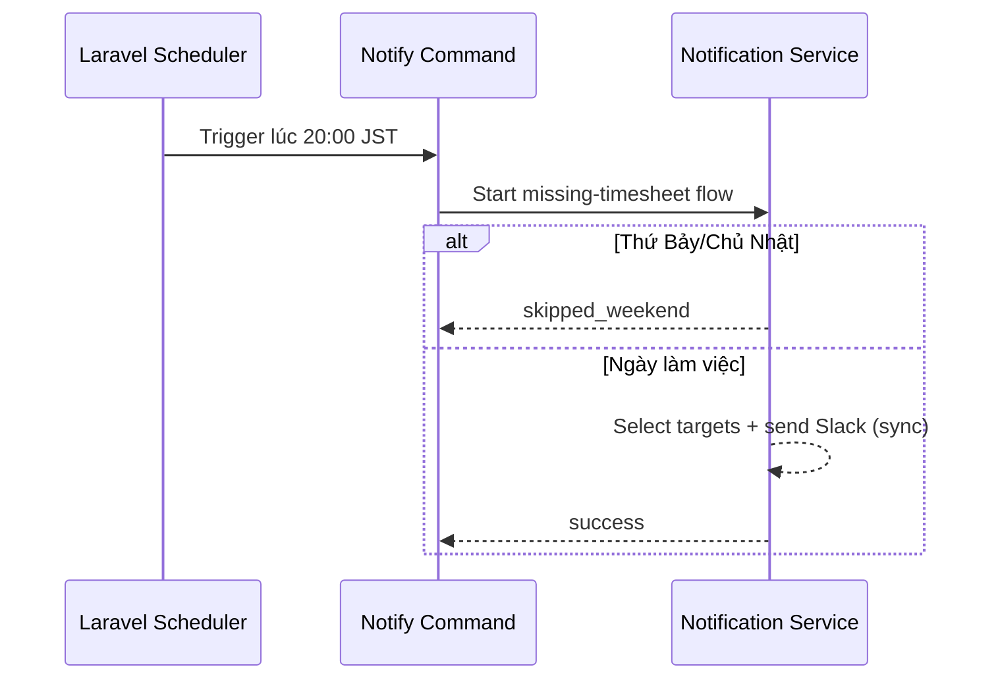

# FLOW-NOTI-01 - Job nhắc nhập công sau 20:00 JST

## 1. Mục tiêu
Thiết lập job chạy tự động để kích hoạt quy trình nhắc nhập công hằng ngày qua Slack bot.

## 2. Vai trò tham gia
- Cron Scheduler (Laravel Scheduler)
- Notification Service

## 3. Điều kiện đầu vào
- Hệ thống đã cấu hình timezone xử lý là `Asia/Tokyo` (JST)
- Scheduler đang chạy ổn định
- Slack integration đã được cấu hình (token/webhook/channel)

## 4. Kết quả đầu ra
- Job nhắc nhập công được trigger đúng thời điểm
- Một execution context được tạo để chạy các bước lọc đối tượng và gửi Slack

## 5. Luồng chính (Happy Path)
1. Scheduler kiểm tra lịch chạy theo phút.
2. Đến 20:00 JST của ngày làm việc, Scheduler trigger `timesheet:notify-missing`.
3. Job tạo execution log (run_at, timezone, status = processing).
4. Job gọi service lọc danh sách nhân viên cần nhắc.
5. Job gọi trực tiếp service gửi Slack cho từng nhân viên hoặc theo batch nhỏ.
6. Job cập nhật execution log trạng thái thành `success`.

## 6. Luồng thay thế và lỗi
### L1 - Hôm nay là Thứ Bảy/Chủ Nhật
1. Scheduler vẫn có thể trigger command.
2. Notification service kiểm tra day-of-week và kết thúc sớm.
3. Execution log ghi `skipped_weekend`.

### L2 - Scheduler chạy trễ hoặc chạy lặp
1. Job kiểm tra idempotency key theo ngày JST.
2. Nếu đã chạy thành công trong ngày, job bỏ qua và ghi `skipped_duplicate`.

### L3 - Lỗi hệ thống khi trigger downstream
1. Job ghi log lỗi.
2. Retry đơn giản ngay trong command (ví dụ tối đa 2-3 lần với backoff ngắn).
3. Nếu quá số lần retry, ghi `failed` và cảnh báo admin kỹ thuật.

## 7. Business rules
- BR-NOTI-SCH-01: Job nhắc công chạy mỗi ngày lúc `20:00 JST`.
- BR-NOTI-SCH-02: Không gửi nhắc vào Thứ Bảy, Chủ Nhật.
- BR-NOTI-SCH-03: Không loại trừ nghỉ phép/ngày lễ trong MVP.
- BR-NOTI-SCH-04: Mỗi ngày JST chỉ có 1 lần chạy hợp lệ (idempotent).

## 8. API mapping
- Không có API public cho flow này.
- Mapping kỹ thuật nội bộ gợi ý:
  - Laravel command: `php artisan timesheet:notify-missing`
  - Scheduler: `dailyAt('20:00')->timezone('Asia/Tokyo')`
  - Service call đồng bộ: `MissingTimesheetNotificationService::handle(target_date)`

## 9. Điểm cần test
- Job chạy đúng lúc 20:00 JST.
- Job không xử lý vào Thứ Bảy/Chủ Nhật.
- Job không chạy trùng trong cùng 1 ngày JST.
- Khi downstream lỗi, retry hoạt động đúng.

## 10. Sequence flow (rút gọn)

