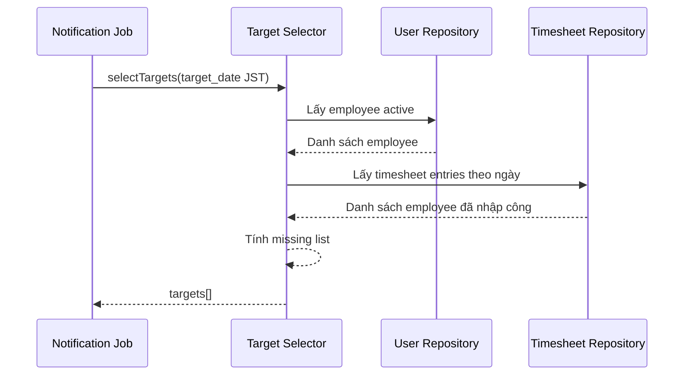

# FLOW-NOTI-02 - Lọc đối tượng cần nhắc

## 1. Mục tiêu
Xác định danh sách nhân viên chưa nhập công trong ngày để gửi nhắc Slack.

## 2. Vai trò tham gia
- Notification Service
- Timesheet API/Repository
- User/Employee Repository

## 3. Điều kiện đầu vào
- Có execution context từ flow schedule job
- Đã xác định `target_date` theo JST (ngày hiện tại tại thời điểm 20:00)
- Dữ liệu user và timesheet có sẵn

## 4. Kết quả đầu ra
- Danh sách nhân viên cần nhắc (`missing_timesheet_targets`)
- Danh sách được chuẩn hóa để chuyển sang bước gửi Slack

## 5. Luồng chính (Happy Path)
1. Notification service lấy danh sách employee trạng thái `active`.
2. Lấy danh sách timesheet entry header của `target_date` theo JST.
3. So sánh theo `employee_id`.
4. Nhân viên không có entry trong ngày được đưa vào `missing list`.
5. Trả danh sách mục tiêu cho bước gửi tin nhắn.

## 6. Luồng thay thế và lỗi
### L1 - Không có nhân viên nào cần nhắc
1. Service trả danh sách rỗng.
2. Luồng gửi Slack bỏ qua, execution kết thúc thành công.

### L2 - Dữ liệu timesheet truy vấn lỗi
1. Service ghi log lỗi.
2. Trả trạng thái failed để scheduler retry theo chính sách.

### L3 - Nhân viên không có Slack ID
1. Vẫn có thể giữ trong danh sách cần nhắc với trạng thái `missing_slack_binding`.
2. Bước gửi sẽ bỏ qua user này và ghi log để admin bổ sung mapping.

## 7. Business rules
- BR-NOTI-TARGET-01: Chỉ xét user role `employee` và trạng thái `active`.
- BR-NOTI-TARGET-02: Tiêu chí "đã nhập công" của ngày = tồn tại ít nhất 1 `timesheet entry (header)` trong ngày.
- BR-NOTI-TARGET-03: Không xét nghỉ phép/ngày lễ trong MVP.
- BR-NOTI-TARGET-04: Không xét Thứ Bảy/Chủ Nhật (đã chặn từ flow schedule).

## 8. API mapping
- Không có API public bắt buộc.
- Mapping nội bộ gợi ý:
  - Query employees: `SELECT * FROM users WHERE role='employee' AND status='active'`
  - Query entries theo ngày: `timesheet_entries` với `entry_date = target_date`
  - Kết quả trả về cho sender:
```json
{
  "target_date": "2026-04-06",
  "timezone": "Asia/Tokyo",
  "targets": [
    {
      "employee_id": 101,
      "employee_name": "Tran Thi Hoa",
      "slack_user_id": "U01234567"
    }
  ]
}
```

## 9. Điểm cần test
- Có entry trong ngày thì không bị nhắc.
- Không có entry trong ngày thì vào danh sách nhắc.
- User inactive không nằm trong danh sách nhắc.
- Danh sách rỗng vẫn hoàn tất flow thành công.
- User thiếu Slack ID được đánh dấu để bỏ qua ở bước gửi.

## 10. Sequence flow (rút gọn)

