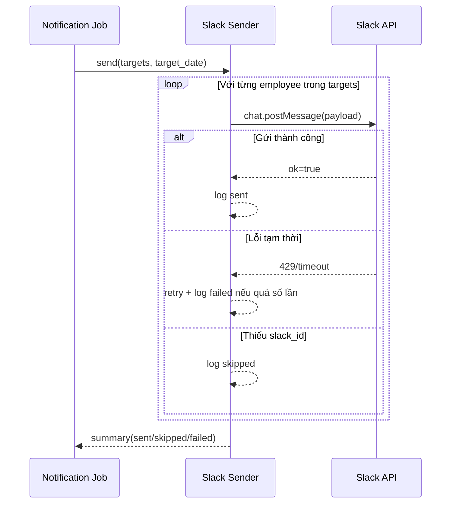

# FLOW-NOTI-03 - Gửi message Slack bot

## 1. Mục tiêu
Gửi tin nhắn nhắc nhập công qua Slack bot cho nhân viên nằm trong danh sách thiếu công.

## 2. Vai trò tham gia
- Notification Sender Service
- Slack Bot API
- Employee (người nhận)

## 3. Điều kiện đầu vào
- Có danh sách `targets` từ flow lọc đối tượng
- Cấu hình Slack bot/token/channel hợp lệ
- Template message đã được chuẩn hóa

## 4. Kết quả đầu ra
- Tin nhắn nhắc công được gửi đến Slack user/channel tương ứng
- Log kết quả gửi theo từng người nhận (`sent`, `skipped`, `failed`)

## 5. Luồng chính (Happy Path)
1. Sender nhận danh sách `targets`.
2. Duyệt từng target, dựng nội dung tin nhắn theo template.
3. Gọi Slack API để gửi DM hoặc mention trong channel.
4. Slack trả kết quả thành công.
5. Sender ghi log `sent` theo employee.
6. Hoàn tất batch gửi.

## 6. Luồng thay thế và lỗi
### L1 - Target thiếu Slack ID
1. Sender bỏ qua target.
2. Ghi log `skipped_missing_slack_id`.

### L2 - Slack API rate limit hoặc lỗi tạm thời
1. Sender nhận lỗi `429` hoặc lỗi mạng.
2. Retry theo backoff.
3. Nếu quá retry thì ghi `failed`.

### L3 - Slack token/channel không hợp lệ
1. Sender nhận lỗi auth/config.
2. Dừng batch hoặc đánh failed toàn batch tùy policy.
3. Cảnh báo cho admin kỹ thuật.

## 7. Business rules
- BR-NOTI-SEND-01: Chỉ gửi cho danh sách đã lọc từ flow `NOTI-02`.
- BR-NOTI-SEND-02: Một employee trong một ngày chỉ nhận tối đa 1 tin nhắc.
- BR-NOTI-SEND-03: Nội dung tin nhắn cần ghi rõ ngày chưa nhập công theo JST.
- BR-NOTI-SEND-04: Nếu gửi lỗi phải có log để truy vết vận hành.

## 8. API mapping
- Không có API public cho frontend trong MVP.
- Tích hợp outbound:
  - Slack Web API: `chat.postMessage` (hoặc webhook)

Payload gợi ý:
```json
{
  "channel": "U01234567",
  "text": "[Nhắc nhập công] Bạn chưa nhập timesheet cho ngày 2026-04-06 (JST). Vui lòng cập nhật sớm."
}
```

Response gợi ý:
```json
{
  "ok": true,
  "channel": "U01234567",
  "ts": "1712392000.123456"
}
```

## 9. Điểm cần test
- Gửi thành công cho danh sách target hợp lệ.
- Skip đúng khi thiếu Slack ID.
- Retry đúng khi Slack trả `429`.
- Không gửi trùng trong cùng ngày cho cùng employee.
- Nội dung message hiển thị đúng ngày JST.

## 10. Sequence flow (rút gọn)

