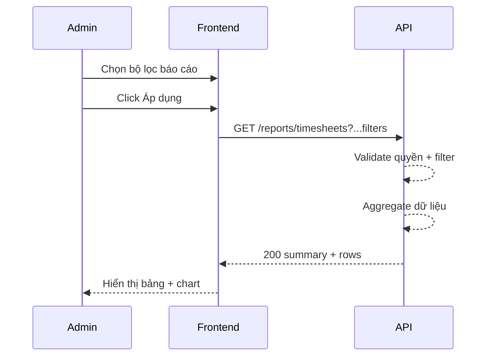

# FLOW-REPORT-02 - Báo cáo tổng hợp theo bộ lọc

## 1. Mục tiêu
Cho admin lọc và xem báo cáo giờ làm theo nhiều chiều: tháng, nhân viên, project, phòng ban.

## 2. Vai trò tham gia
- Admin
- Frontend màn hình `SCR-11`
- Report API

## 3. Điều kiện đầu vào
- Admin đăng nhập hợp lệ
- Có dữ liệu timesheet trong hệ thống

## 4. Kết quả đầu ra
- Báo cáo tổng hợp hiển thị đúng theo bộ lọc
- Có summary + bảng chi tiết + dữ liệu chart

## 5. Luồng chính (Happy Path)
1. Admin mở màn hình báo cáo.
2. Chọn bộ lọc: tháng, nhân viên, project, phòng ban.
3. Bấm `Áp dụng bộ lọc`.
4. Frontend gọi API report với query tương ứng.
5. Backend validate quyền admin và tham số lọc.
6. Backend tổng hợp dữ liệu theo filter.
7. Backend trả summary + dataset.
8. Frontend render số liệu, bảng và biểu đồ.

## 6. Luồng thay thế và lỗi
### L1 - Không có dữ liệu theo filter
1. API trả dataset rỗng.
2. Frontend hiển thị empty state.

### L2 - Filter không hợp lệ
1. API trả `400`.
2. Frontend hiển thị lỗi và giữ trạng thái filter.

### L3 - Không đủ quyền
1. API trả `403`.

## 7. Business rules
- BR-REPORT-01: Chỉ admin xem báo cáo tổng hợp toàn hệ thống.
- BR-REPORT-02: `month` nên có mặc định (tháng hiện tại).
- BR-REPORT-03: Filter phải được áp dụng đồng thời (AND logic).

## 8. API mapping
### API-01: Query report
- Method: `GET`
- Endpoint: `/api/v1/reports/timesheets`
- Query params ví dụ:
  - `month=2026-04`
  - `employee_id=101`
  - `project_id=10227`
  - `department_id=3`

Success response gợi ý:
```json
{
  "summary": {
    "total_hours": 3248,
    "billable_hours": 2614,
    "non_billable_hours": 634
  },
  "rows": []
}
```

Error response gợi ý:
- `400`, `403`, `500`

## 9. Điểm cần test
- Lọc theo tháng.
- Lọc kết hợp nhiều điều kiện.
- Filter trả về rỗng.
- User không phải admin.
- Độ chính xác số liệu summary so với dữ liệu gốc.

## 10. Sequence flow (rút gọn)

