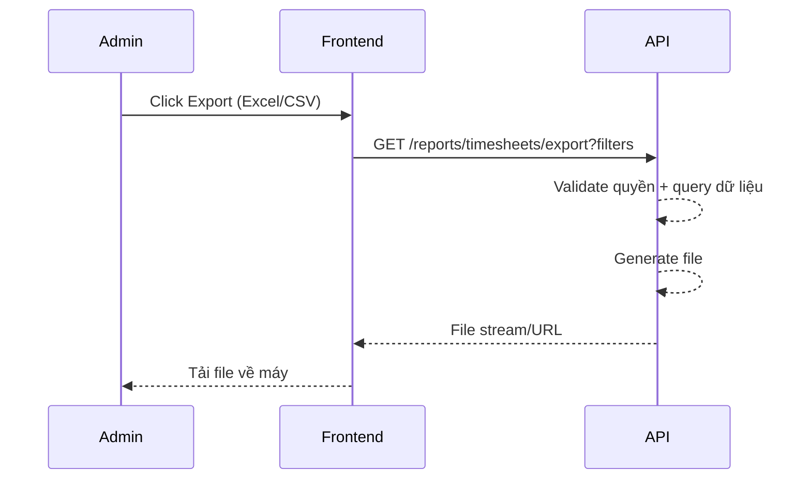

# FLOW-REPORT-03 - Export Excel/CSV

## 1. Mục tiêu
Cho admin xuất dữ liệu báo cáo theo bộ lọc hiện tại ra file Excel/CSV.

## 2. Vai trò tham gia
- Admin
- Frontend màn hình `SCR-11`
- Report Export API

## 3. Điều kiện đầu vào
- Admin đăng nhập hợp lệ
- Bộ lọc báo cáo đã được chọn

## 4. Kết quả đầu ra
- File export được tải về thành công
- Nội dung file đúng theo bộ lọc đang áp dụng

## 5. Luồng chính (Happy Path)
1. Admin chọn filter trên màn hình báo cáo.
2. Admin bấm `Export Excel` hoặc `Export CSV`.
3. Frontend gọi API export kèm filter + format.
4. Backend validate quyền admin.
5. Backend query dữ liệu theo filter.
6. Backend tạo file export.
7. Backend trả file hoặc trả URL tải file.
8. Frontend trigger download.

## 6. Luồng thay thế và lỗi
### L1 - Dữ liệu rỗng
1. Hệ thống vẫn có thể export file trống có header.
2. Hoặc trả cảnh báo “Không có dữ liệu để export”.

### L2 - Export quá nặng
1. Backend chuyển sang xử lý async (nếu cần).
2. Trả trạng thái đang xử lý và URL tải sau.

### L3 - Không đủ quyền
1. API trả `403`.

## 7. Business rules
- BR-EXPORT-01: Chỉ admin được export báo cáo tổng hợp.
- BR-EXPORT-02: Export phải bám đúng filter hiện tại.
- BR-EXPORT-03: Tên file nên chứa tháng/filter chính.

## 8. API mapping
### API-01: Export report
- Method: `GET`
- Endpoint: `/api/v1/reports/timesheets/export`
- Query params:
  - `month=2026-04`
  - `format=xlsx|csv`
  - các filter khác

Success response:
- `200` file stream (hoặc `202` nếu async)

## 9. Điểm cần test
- Export Excel thành công.
- Export CSV thành công.
- Export với filter cụ thể.
- Export khi không có dữ liệu.
- User không phải admin.

## 10. Sequence flow (rút gọn)

