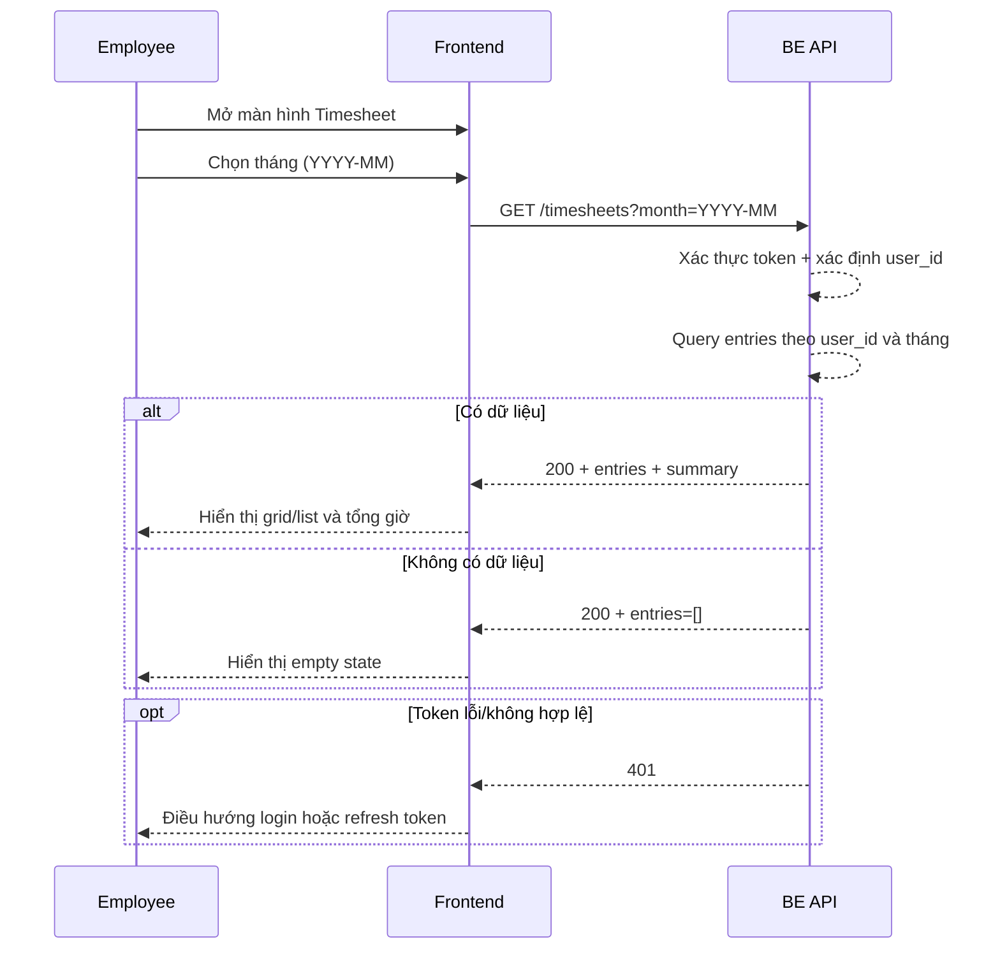

# FLOW-TS-01 - Xem danh sách timesheet theo tháng (API list)

## 1. Mục tiêu
Cho employee xem dữ liệu timesheet của chính mình theo tháng để:
- Nắm tổng giờ theo ngày/project
- Theo dõi dữ liệu đã nhập
- Làm nền cho thao tác sửa hoặc thêm entry mới
- Theo mô hình dữ liệu: 1 ngày = 1 `entry` (header), gồm nhiều `details`

## 2. Vai trò tham gia
- Employee
- Timesheet API (Laravel)
- Frontend màn hình `SCR-14`

## 3. Điều kiện đầu vào
- Người dùng đã đăng nhập hợp lệ
- Token JWT còn hiệu lực
- User có role `employee`
- User có ít nhất 1 project đã được assign (nếu không có thì trả danh sách rỗng)
- Người dùng chọn 1 tháng cần xem

## 4. Kết quả đầu ra
- Danh sách timesheet theo cấu trúc header-detail:
  - `entry`: đại diện cho 1 ngày
  - `details`: các dòng project trong ngày
- Dữ liệu chỉ thuộc user hiện tại
- Frontend hiển thị:
  - Bảng/grid theo project-ngày
  - Hoặc list entry theo ngày
- Trả thêm metadata để tính tổng giờ theo ngày/tháng nếu cần

## 5. Luồng chính (Happy Path)
1. Employee mở màn hình timesheet (`SCR-14`).
2. Frontend lấy tháng mặc định (tháng hiện tại) hoặc tháng user chọn.
3. Frontend gọi API list timesheet theo tháng.
4. Backend xác thực token và lấy `user_id`.
5. Backend truy vấn `entries` của `user_id` trong khoảng ngày của tháng.
6. Backend load `details` tương ứng cho từng entry và join thông tin project.
7. Backend trả danh sách header-detail + metadata tổng hợp.
8. Frontend render dữ liệu theo list/grid và hiển thị tổng giờ.

## 6. Luồng thay thế và lỗi

### L1 - Không có dữ liệu trong tháng
1. API trả danh sách rỗng.
2. Frontend hiển thị empty state “Chưa có dữ liệu”.
3. User có thể bấm nút thêm entry.

### L2 - Token hết hạn/không hợp lệ
1. API trả `401`.
2. Frontend điều hướng về đăng nhập hoặc trigger refresh token theo cơ chế hệ thống.

### L3 - User không có quyền
1. User không phải employee hoặc truy cập sai phạm vi dữ liệu.
2. API trả `403`.
3. Frontend hiển thị thông báo không đủ quyền.

### L4 - Lỗi hệ thống
1. API trả `500`.
2. Frontend hiển thị thông báo lỗi và nút thử lại.

## 7. Business rules
- BR-TS-LIST-01: Employee chỉ được xem timesheet của chính mình.
- BR-TS-LIST-02: Dữ liệu trả về chỉ trong tháng yêu cầu.
- BR-TS-LIST-03: Chỉ hiển thị project đã assign cho employee.
- BR-TS-LIST-04: Nếu không có dữ liệu phải trả danh sách rỗng, không coi là lỗi.
- BR-TS-LIST-05: Khuyến nghị sort theo `work_date` tăng dần, sau đó theo project.

## 8. API mapping

### API-01: List timesheet theo tháng (header-detail)
- Method: `GET`
- Endpoint: `/api/v1/timesheets`
- Query params:
  - `month=2026-04` (định dạng `YYYY-MM`)
- Header:
  - `Authorization: Bearer <token>`

Request ví dụ:
```http
GET /api/v1/timesheets?month=2026-04
```

Success response gợi ý:
```json
{
  "month": "2026-04",
  "entries": [
    {
      "entry_id": 9001,
      "work_date": "2026-04-01",
      "total_hours": 8.0,
      "details": [
        {
          "detail_id": 50001,
          "project_id": 10227,
          "project_code": "PJ-10227",
          "project_name": "ALLRORA QC",
          "hours_worked": 5.5,
          "note": "Kiểm thử chức năng QC nội bộ"
        },
        {
          "detail_id": 50002,
          "project_id": 10963,
          "project_code": "PJ-10963",
          "project_name": "WORK DESIGN 4",
          "hours_worked": 2.5,
          "note": "Kiểm tra ticket WDP-421"
        }
      ]
    }
  ],
  "summary": {
    "total_hours_month": 146.5
  }
}
```

Error response gợi ý:
- `400`: month không hợp lệ
- `401`: chưa xác thực/het hạn token
- `403`: không đủ quyền
- `500`: lỗi hệ thống

### API-02: List project đã assign (nếu frontend cần gọi riêng)
- Method: `GET`
- Endpoint: `/api/v1/my-projects`

## 9. Điểm cần test
- Truy cập tháng có dữ liệu.
- Truy cập tháng không có dữ liệu.
- Đổi tháng liên tục và kiểm tra dữ liệu cập nhật đúng.
- Token hết hạn trong lúc gọi API.
- Đảm bảo user A không thấy dữ liệu user B.
- Kiểm tra dữ liệu hiển thị đúng project đã assign.
- Kiểm tra tổng giờ tháng hiển thị đúng theo entries trả về.

## 10. Sequence flow (rút gọn)

