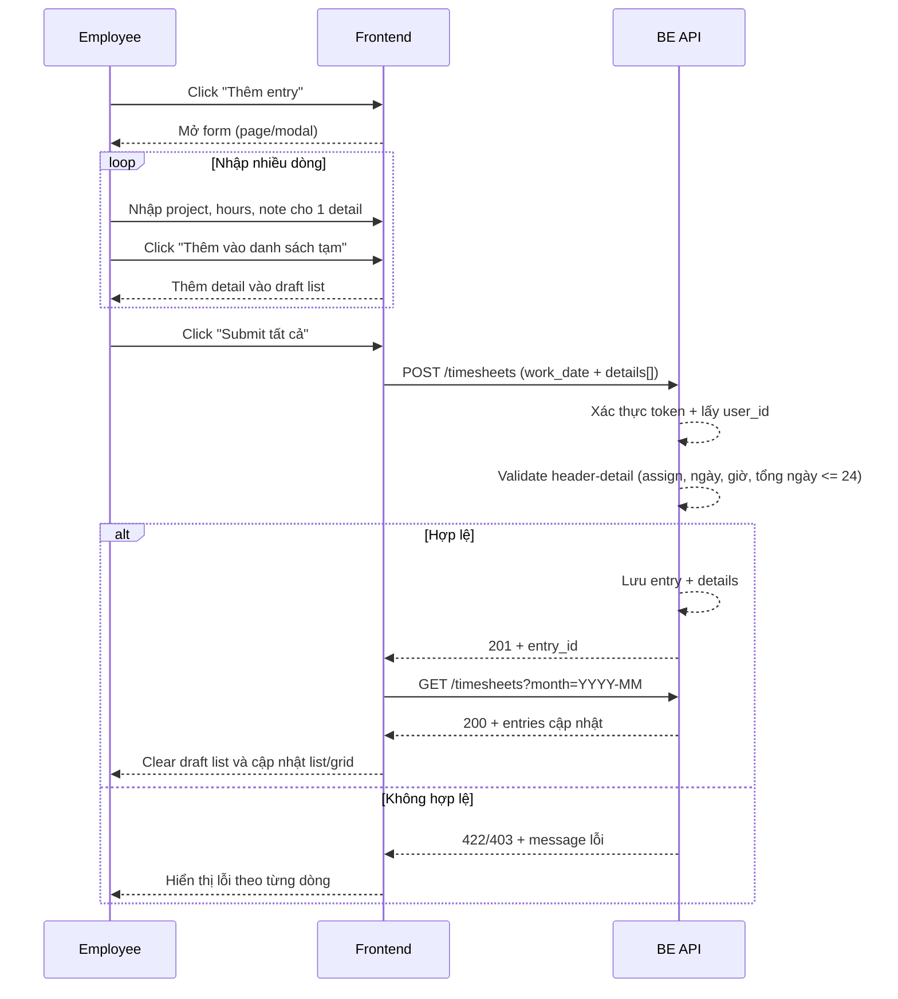

# FLOW-TS-02 - Thêm timesheet theo mô hình entry + details và submit một lần

## 1. Mục tiêu
Cho employee nhập timesheet theo mô hình:
- 1 `entry` cho 1 ngày làm việc
- nhiều `details` cho các project trong ngày
và submit một lần để giảm thao tác bấm nhiều lần.

## 2. Vai trò tham gia
- Employee
- Timesheet API (Laravel)
- Frontend màn hình `SCR-14A` hoặc modal `SCR-14B`

## 3. Điều kiện đầu vào
- Người dùng đã đăng nhập hợp lệ
- Token JWT còn hiệu lực
- User có role `employee`
- User có project đã assign để chọn
- Người dùng mở form thêm entry từ màn hình timesheet
- FE có cơ chế quản lý danh sách entry tạm (client draft list)

## 4. Kết quả đầu ra
- 1 entry (theo ngày) và nhiều details của entry đó được lưu thành công trong một lần submit
- Dữ liệu list/grid được cập nhật lại sau khi submit
- Nếu có entry lỗi validation thì FE hiển thị rõ theo từng dòng

## 5. Luồng chính (Happy Path)
1. Employee bấm nút `Thêm entry` từ màn hình timesheet list/grid.
2. Frontend mở form (route riêng hoặc modal).
3. Employee chọn `work_date` cho entry header.
4. Employee nhập từng detail gồm:
  - `project_id`
  - `hours_worked`
  - `note` (tuỳ chọn)
5. Employee bấm `Thêm vào danh sách tạm` để thêm detail vào entry.
6. Employee tiếp tục nhập thêm các detail khác (ví dụ 3 project trong cùng 1 ngày).
7. Employee bấm `Submit tất cả`.
8. Frontend validate toàn bộ details trước khi gửi.
9. Frontend gọi API create theo cấu trúc entry + details.
10. Backend xác thực token và kiểm tra nghiệp vụ cho entry/details:
  - work_date có phải ngày tương lai không
  - project có thuộc danh sách assign của user không
  - hours_worked hợp lệ không
  - tổng giờ của toàn bộ details trong ngày có vượt 24 không
11. Backend lưu entry header và details (ưu tiên transaction).
12. Backend trả kết quả thành công.
13. Frontend clear draft list và refresh list/grid timesheet tháng hiện tại.

## 6. Luồng thay thế và lỗi

### L1 - Thiếu field bắt buộc ở một dòng
1. User bấm `Thêm vào danh sách tạm` khi thiếu `work_date` hoặc `project_id` hoặc `hours_worked`.
2. Frontend chặn thêm dòng và hiển thị lỗi field.

### L2 - Chọn ngày tương lai trong một dòng
1. Frontend có thể chặn ngay tại date picker.
2. Nếu vẫn lọt request, backend trả lỗi validation.

### L3 - Project không thuộc danh sách assign
1. Backend kiểm tra từng dòng trong batch.
2. Backend trả lỗi chi tiết theo dòng vi phạm.
3. Frontend highlight đúng dòng lỗi.

### L4 - Tổng giờ trong ngày vượt 24
1. Backend tính tổng giờ theo từng ngày dựa trên dữ liệu hiện có + toàn bộ batch mới.
2. Nếu > 24, backend trả lỗi validation.
3. Frontend hiển thị rõ ngày nào vượt ngưỡng.

### L5 - Token hết hạn/lỗi hệ thống
1. API trả `401` hoặc `500`.
2. Frontend xử lý theo chuẩn auth/lỗi chung.

### L6 - Submit một phần thành công (nếu hệ thống cho phép)
1. Một số dòng thành công, một số dòng lỗi.
2. Backend trả danh sách dòng lỗi.
3. Frontend giữ lại các dòng lỗi để user chỉnh sửa.
4. Khuyến nghị MVP: chọn cơ chế all-or-nothing để giảm phức tạp.

## 7. Business rules
- BR-TS-CREATE-01: Mỗi dòng phải có `work_date`, `project_id`, `hours_worked`.
- BR-TS-CREATE-02: Không cho nhập `work_date` ở tương lai.
- BR-TS-CREATE-03: Chỉ được chọn `project` đã assign cho user.
- BR-TS-CREATE-04: `hours_worked` phải >= 0.
- BR-TS-CREATE-05: Cho phép số lẻ như `0.25`, `0.5`.
- BR-TS-CREATE-06: Tổng giờ trong một ngày của user không được vượt quá 24 (tính cả batch submit).
- BR-TS-CREATE-07: `note` không bắt buộc, nhưng nên giới hạn độ dài (ví dụ 1000 ký tự).
- BR-TS-CREATE-08: Khuyến nghị MVP dùng cơ chế submit theo transaction all-or-nothing.

## 8. API mapping

### API-01: Create one timesheet entry with details
- Method: `POST`
- Endpoint: `/api/v1/timesheets`
- Header:
  - `Authorization: Bearer <token>`

Request body ví dụ:
```json
{
  "work_date": "2026-04-03",
  "details": [
    {
      "project_id": 10227,
      "hours_worked": 2.5,
      "note": "Kiểm thử giao diện, xác nhận lỗi và cập nhật kết quả."
    },
    {
      "project_id": 10963,
      "hours_worked": 3.0,
      "note": "Kiểm thử regression cho WDP."
    },
    {
      "project_id": 7451,
      "hours_worked": 1.5,
      "note": "Cập nhật checklist test."
    }
  ]
}
```

Success response gợi ý:
```json
{
  "entry_id": 9012,
  "work_date": "2026-04-03",
  "total_hours": 7.0,
  "created_detail_count": 3
}
```

Error response gợi ý:
- `400`: dữ liệu request không hợp lệ format
- `401`: chưa xác thực/het hạn token
- `403`: project không thuộc quyền user
- `422`: vi phạm rule nghiệp vụ (ngày tương lai, vượt 24h/ngày, số giờ âm...)
- `500`: lỗi hệ thống

### API-02: Reload list sau khi tạo
- Method: `GET`
- Endpoint: `/api/v1/timesheets?month=YYYY-MM`

## 9. Điểm cần test
- Thêm nhiều dòng tạm trên FE trước khi submit.
- Submit batch hợp lệ thành công.
- Submit batch với giờ lẻ `0.25` và `0.5`.
- Có 1 dòng ngày tương lai trong batch (phải fail).
- Có 1 dòng project chưa assign trong batch (phải fail).
- Batch khiến tổng ngày > 24 (phải fail).
- Batch với `note` dài gần ngưỡng giới hạn.
- Submit xong, list/grid cập nhật đúng.
- Test nút `Thêm vào danh sách tạm`, `Xóa dòng`, `Submit tất cả`.

## 10. Sequence flow (rút gọn)

