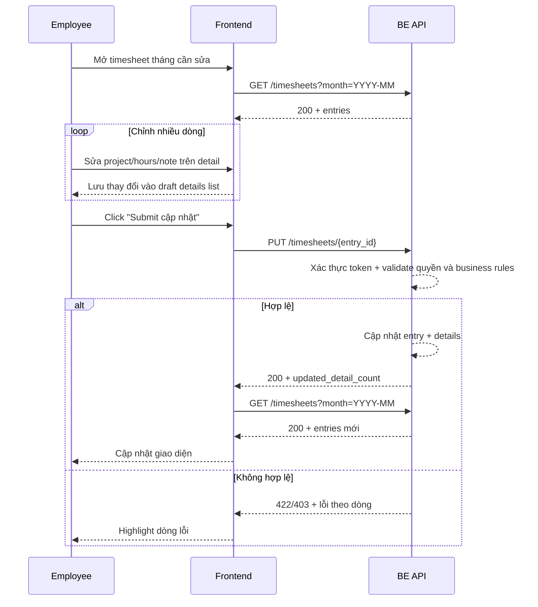

# FLOW-TS-03 - Sửa entry timesheet

## 1. Mục tiêu
Cho employee chỉnh sửa 1 timesheet entry theo ngày và các details bên trong entry đó, sau đó submit một lần.

## 2. Vai trò tham gia
- Employee
- Timesheet API (Laravel)
- Frontend màn hình `SCR-14` + `SCR-14A/14B`

## 3. Điều kiện đầu vào
- Người dùng đã đăng nhập hợp lệ
- Token JWT còn hiệu lực
- User có role `employee`
- Đã có dữ liệu timesheet trong tháng
- Entry cần sửa thuộc về chính user

## 4. Kết quả đầu ra
- Các entry được cập nhật thành công theo dữ liệu mới
- List/grid được reload với dữ liệu mới nhất
- Nếu có dòng lỗi validation thì FE hiển thị lỗi theo từng dòng

## 5. Luồng chính (Happy Path)
1. Employee mở màn hình timesheet tháng cần sửa.
2. FE hiển thị danh sách entry từ API list.
3. Employee chọn 1 `entry` theo ngày để chỉnh sửa.
4. Employee chỉnh 1 hoặc nhiều `detail` (project/hours/note) trong entry.
5. FE ghi nhận các thay đổi vào draft details update list.
6. Employee bấm `Submit cập nhật`.
7. FE validate dữ liệu thay đổi ở client.
8. FE gọi API update entry + details.
9. Backend xác thực token, kiểm tra quyền sở hữu entry, và validate nghiệp vụ:
  - ngày không được ở tương lai
  - project vẫn thuộc danh sách assign
  - số giờ hợp lệ
  - tổng giờ của toàn bộ details sau cập nhật không vượt 24
10. Backend cập nhật dữ liệu (ưu tiên transaction).
11. Backend trả kết quả thành công.
12. FE clear draft update list và reload list/grid.

## 6. Luồng thay thế và lỗi

### L1 - Entry không thuộc user hiện tại
1. FE gửi batch update có entry không thuộc user.
2. Backend trả `403`.
3. FE hiển thị lỗi không đủ quyền.

### L2 - Vi phạm rule ngày tương lai
1. User sửa `work_date` sang ngày tương lai.
2. Backend trả `422`.
3. FE highlight dòng lỗi.

### L3 - Vi phạm tổng giờ > 24
1. Sau chỉnh sửa, tổng giờ của một ngày vượt 24.
2. Backend trả `422` kèm thông tin ngày vi phạm.
3. FE hiển thị cảnh báo rõ theo ngày.

### L4 - Token hết hạn/lỗi hệ thống
1. API trả `401` hoặc `500`.
2. FE xử lý theo chuẩn auth/lỗi chung.

## 7. Business rules
- BR-TS-UPDATE-01: Chỉ được sửa entry của chính mình.
- BR-TS-UPDATE-02: Không cho sửa sang ngày tương lai.
- BR-TS-UPDATE-03: Project sau khi sửa vẫn phải nằm trong danh sách assign của user.
- BR-TS-UPDATE-04: `hours_worked` phải >= 0.
- BR-TS-UPDATE-05: Cho phép số lẻ như `0.25`, `0.5`.
- BR-TS-UPDATE-06: Tổng giờ theo từng ngày sau update không vượt 24.
- BR-TS-UPDATE-07: Khuyến nghị cơ chế all-or-nothing cho MVP.

## 8. API mapping

### API-01: Update one entry with details
- Method: `PUT`
- Endpoint: `/api/v1/timesheets/{entry_id}`
- Header:
  - `Authorization: Bearer <token>`

Request body ví dụ:
```json
{
  "work_date": "2026-04-03",
  "details": [
    {
      "detail_id": 50001,
      "project_id": 10227,
      "hours_worked": 3.0,
      "note": "Cập nhật thêm regression test"
    },
    {
      "detail_id": 50002,
      "project_id": 10963,
      "hours_worked": 2.0,
      "note": "Giảm giờ do tách task"
    }
  ]
}
```

Success response gợi ý:
```json
{
  "entry_id": 9012,
  "updated_detail_count": 2
}
```

Error response gợi ý:
- `400`: dữ liệu request sai format
- `401`: chưa xác thực/het hạn token
- `403`: entry không thuộc quyền user
- `422`: vi phạm rule nghiệp vụ
- `500`: lỗi hệ thống

### API-02: Reload list sau khi cập nhật
- Method: `GET`
- Endpoint: `/api/v1/timesheets?month=YYYY-MM`

## 9. Điểm cần test
- Sửa 1 entry hợp lệ.
- Sửa nhiều entry rồi submit một lần.
- Sửa entry sang project không assign (phải fail).
- Sửa entry sang ngày tương lai (phải fail).
- Sửa entry khiến tổng ngày > 24 (phải fail).
- Đảm bảo không sửa được entry của user khác.
- Submit xong, list/grid hiển thị dữ liệu mới đúng.

## 10. Sequence flow (rút gọn)

