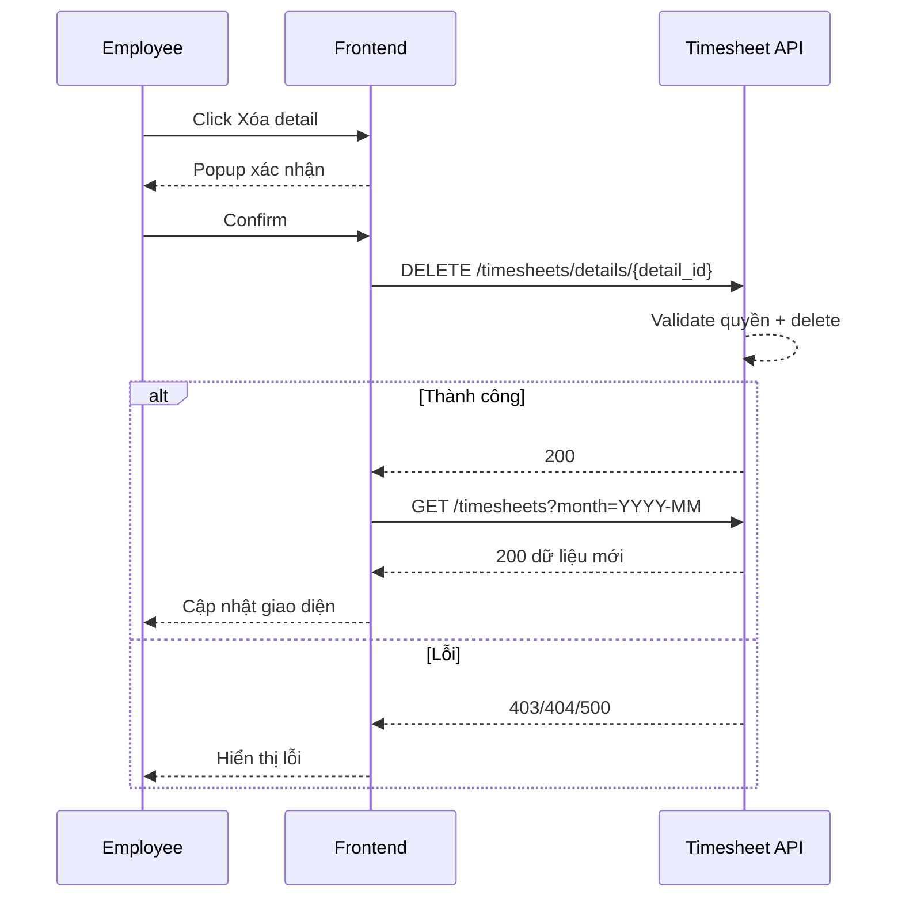

# FLOW-TS-04 - Xóa detail trong timesheet entry

## 1. Mục tiêu
Cho employee xóa một detail (dòng project) trong entry theo ngày trước hoặc sau khi submit.

## 2. Vai trò tham gia
- Employee
- Frontend màn hình `SCR-14/14A/14B`
- Timesheet API

## 3. Điều kiện đầu vào
- User đăng nhập hợp lệ
- Detail cần xóa thuộc entry của chính user

## 4. Kết quả đầu ra
- Detail bị xóa thành công
- Tổng giờ entry được cập nhật lại
- Nếu entry không còn detail nào, hệ thống có thể xóa luôn entry header hoặc giữ entry rỗng theo policy

## 5. Luồng chính (Happy Path)
1. User mở entry theo ngày.
2. User bấm `Xóa` ở dòng detail.
3. Frontend yêu cầu xác nhận xóa.
4. User xác nhận.
5. Frontend gọi API xóa detail.
6. Backend validate quyền và kiểm tra detail tồn tại.
7. Backend xóa detail.
8. Backend cập nhật tổng giờ entry.
9. Backend trả success.
10. Frontend reload entry/list.

## 6. Luồng thay thế và lỗi
### L1 - Detail không tồn tại
1. API trả `404`.

### L2 - Detail không thuộc user hiện tại
1. API trả `403`.

### L3 - Lỗi hệ thống
1. API trả `500`.

## 7. Business rules
- BR-TS-DEL-01: Chỉ xóa detail của chính mình.
- BR-TS-DEL-02: Xóa detail phải cập nhật lại tổng giờ entry.
- BR-TS-DEL-03: Cần xác nhận trước khi xóa ở FE.

## 8. API mapping
### API-01: Delete detail
- Method: `DELETE`
- Endpoint: `/api/v1/timesheets/details/{detail_id}`

Success response gợi ý:
```json
{ "message": "Xóa detail thành công." }
```

## 9. Điểm cần test
- Xóa detail hợp lệ.
- Xóa detail không tồn tại.
- Xóa detail không thuộc quyền user.
- Kiểm tra tổng giờ entry sau khi xóa.

## 10. Sequence flow (rút gọn)

