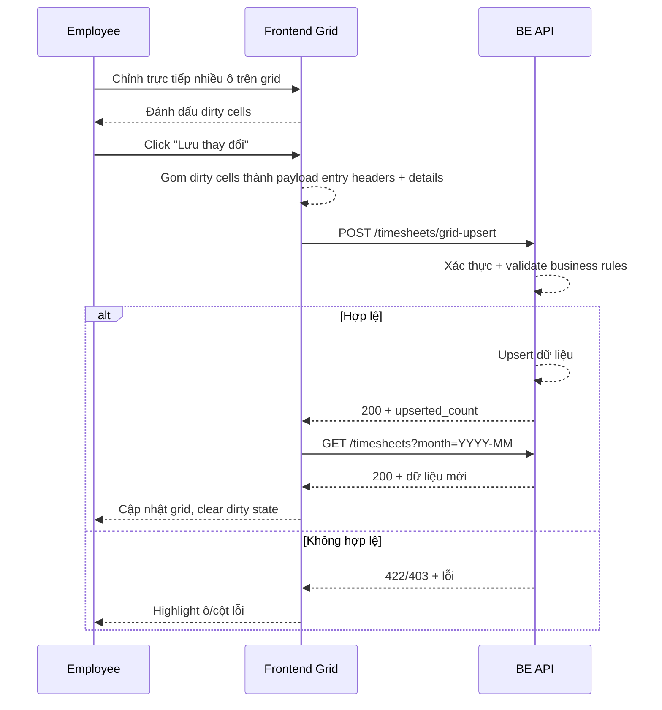

# FLOW-TS-05 - Lưu/chỉnh sửa nhanh trên grid

## 1. Mục tiêu
Cho employee chỉnh sửa nhanh timesheet trực tiếp trên grid theo tháng, rồi submit batch một lần mà không cần mở form cho từng entry.

## 2. Vai trò tham gia
- Employee
- Timesheet API (Laravel)
- Frontend màn hình `SCR-14` (grid theo project/ngày)

## 3. Điều kiện đầu vào
- Người dùng đã đăng nhập hợp lệ
- Token JWT còn hiệu lực
- User có role `employee`
- Dữ liệu tháng đã được load từ API list
- FE có state theo dõi ô nào đã thay đổi (dirty cells)

## 4. Kết quả đầu ra
- Các ô thay đổi được lưu thành công sau một lần submit
- Grid hiển thị lại dữ liệu đã lưu
- Nếu có lỗi thì hiển thị ngay tại ô/dòng tương ứng

## 5. Luồng chính (Happy Path)
1. Employee mở grid timesheet tháng hiện tại.
2. FE hiển thị dữ liệu theo mô hình header-detail:
  - hàng ngày tương ứng entry header
  - ô project/ngày tương ứng detail
3. Employee chỉnh trực tiếp các ô giờ (dirty cells).
4. FE đánh dấu ô đã thay đổi.
5. Employee bấm `Submit tất cả` hoặc `Lưu thay đổi`.
6. FE gom dirty cells thành payload header-detail theo từng ngày.
7. FE validate nhanh tại client.
8. FE gọi API batch upsert theo danh sách entry headers + details.
9. Backend xác thực token + validate nghiệp vụ:
  - project phải thuộc assign
  - ngày không tương lai
  - số giờ hợp lệ
  - tổng giờ/ngày không vượt 24
10. Backend lưu dữ liệu.
11. Backend trả kết quả.
12. FE clear trạng thái dirty và reload grid.

## 6. Luồng thay thế và lỗi

### L1 - User chưa thay đổi dữ liệu nhưng bấm lưu
1. FE phát hiện không có dirty cells.
2. FE không gọi API, hiển thị thông báo “Không có thay đổi”.

### L2 - Ô nhập sai định dạng số
1. User nhập giá trị không hợp lệ (ví dụ chữ).
2. FE đánh dấu lỗi ngay tại ô.
3. Không cho submit khi còn lỗi client.

### L3 - Tổng giờ/ngày vượt 24
1. Backend tính tổng theo ngày từ toàn bộ thay đổi + dữ liệu hiện tại.
2. Backend trả `422` với thông tin ngày vi phạm.
3. FE highlight cột/ngày có vấn đề.

### L4 - Project không assign hoặc lỗi quyền
1. Backend trả `403`/`422`.
2. FE hiển thị lỗi theo ô/dòng.

### L5 - Token hết hạn/lỗi hệ thống
1. API trả `401` hoặc `500`.
2. FE xử lý theo chuẩn auth/lỗi chung.

## 7. Business rules
- BR-TS-GRID-01: Chỉ chỉnh trên project đã assign.
- BR-TS-GRID-02: Không cho chỉnh ngày tương lai.
- BR-TS-GRID-03: Giá trị giờ phải >= 0.
- BR-TS-GRID-04: Cho phép số lẻ `0.25`, `0.5`.
- BR-TS-GRID-05: Tổng giờ theo ngày (sum details) không vượt 24.
- BR-TS-GRID-06: Chỉ submit các ô đã thay đổi để tối ưu payload.

## 8. API mapping

### API-01: Batch upsert từ grid
- Method: `POST`
- Endpoint: `/api/v1/timesheets/grid-upsert`
- Header:
  - `Authorization: Bearer <token>`

Request body ví dụ:
```json
{
  "month": "2026-04",
  "entries": [
    {
      "work_date": "2026-04-03",
      "details": [
        {
          "project_id": 10227,
          "hours_worked": 3.0,
          "note": null
        },
        {
          "project_id": 10963,
          "hours_worked": 2.0,
          "note": null
        }
      ]
    }
  ]
}
```

Success response gợi ý:
```json
{
  "upserted_count": 2
}
```

Error response gợi ý:
- `400`: request sai format
- `401`: chưa xác thực/het hạn token
- `403`: không đủ quyền
- `422`: vi phạm nghiệp vụ
- `500`: lỗi hệ thống

### API-02: Reload grid
- Method: `GET`
- Endpoint: `/api/v1/timesheets?month=YYYY-MM`

## 9. Điểm cần test
- Chỉnh 1 ô hợp lệ và lưu thành công.
- Chỉnh nhiều ô khác project cùng ngày và submit 1 lần.
- Nhập giá trị số lẻ `0.25`, `0.5`.
- Nhập giá trị không hợp lệ (ký tự chữ) bị chặn ở FE.
- Chỉnh khiến tổng ngày > 24 (phải fail).
- Chỉnh trên project không assign (phải fail).
- Submit khi không có thay đổi.
- Sau submit, dirty state được xóa và grid reload đúng.

## 10. Sequence flow (rút gọn)

